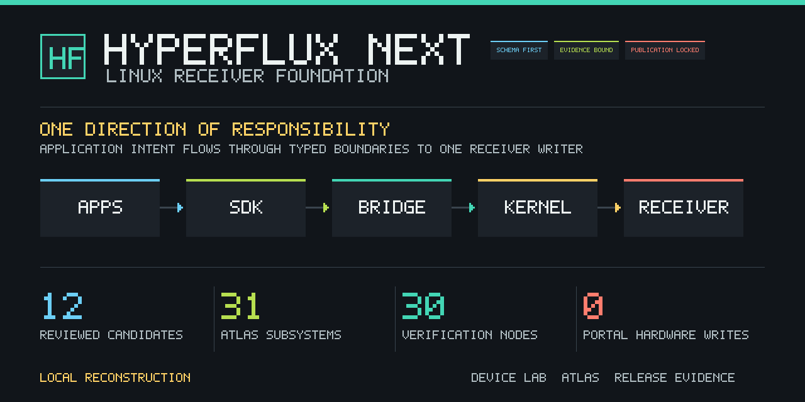
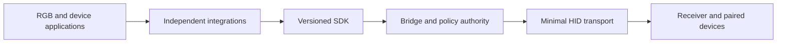

# HyperFlux Next

**A schema-first Linux foundation for devices paired through Razer HyperFlux V2.**

HyperFlux Next separates receiver transport, hardware identity, product policy,
and application presentation. The result is one bounded write path with device
knowledge that can grow without duplicating the same fact across the kernel,
bridge, SDK, integrations, documentation, and tests.



> [!IMPORTANT]
> **Local reconstruction, not a published driver.** The software foundation is
> implemented and locally verified, but physical qualification and publication
> remain separate locked gates. The documentation portal performs no hardware
> writes, and this repository does not authorize a package, release, remote, or
> GitHub Pages deployment.

## System Direction



Applications own names, layouts, zones, effects, and user interaction. The SDK
owns the typed application boundary. The bridge is the sole userspace writer
and owns qualification, scheduling, restoration, and structured outcomes. The
kernel preserves ordinary HID input, observes receiver state, owns generations
and one writer session, and transports validated envelopes.

The [Design Book](docs/architecture/design-book.md) explains the complete model;
the generated [Architecture Constitution](docs/generated/architecture.md) is
its machine-enforced projection.

## Explore The Repository

| Workbench | What it answers | Canonical reference |
| --- | --- | --- |
| **Device Lab** | Which device facts are imported, qualified, inferred, or still unknown? | [Device knowledge](docs/generated/device-knowledge.md) |
| **Repository Atlas** | Which subsystem owns a fact, what depends on it, and what should a change verify? | [Repository atlas](docs/generated/repository-atlas.md) |
| **Repository State** | Which release gates, migration decisions, test budgets, and performance limits apply? | [Release gates](docs/generated/release-gates.md) and [verification graph](docs/generated/verification.md) |

Build the full interactive, audience-separated portal locally:

```sh
./hfx docs build --output build/portal
./hfx docs verify --site build/portal
```

Open `build/portal/index.html`. The artifact is deterministic, offline, and
contains the Device Lab, Repository Atlas, Repository State, search, and
light/dark/system themes. It neither queries devices nor writes hardware.

## Support Boundary

| State | Meaning |
| --- | --- |
| **Implemented** | Canonical models, generators, SDK boundaries, bridge composition, minimal kernel transport, integrations, packaging plans, diagnostics, and software verification exist. |
| **Physically qualified** | Only exact public evidence claims may enable a writable capability for an exact profile. |
| **Candidate** | Official upstream compatibility data can identify a review candidate; a name or PID alone never grants hardware writes. |
| **Unknown** | Unreviewed devices and capabilities fail closed with zero write authority. |
| **Publication locked** | No remote creation, release, tag, Pages deployment, or hardware CI is authorized by repository state. |

See [Supported Hardware](docs/generated/supported-hardware.md) for exact support
language and [Device Knowledge](docs/architecture/device-knowledge.md) for the
provenance model. Imported upstream catalogs remain evidence-bound inputs, not
copies of application transport code.

## Verify A Change

```sh
# Regenerate every declared projection.
./hfx generate

# Run change-aware verification during development.
./hfx verify --changed-from <commit>

# Run the complete current software gate.
./hfx verify --all
```

One canonical owner drives each generated projection. A second `./hfx generate`
must produce no diff. The verification graph records dependencies, isolation,
expected-time budgets, timeouts, evidence outputs, and whether a node could
write hardware.

## Repository Areas

| Area | Responsibility |
| --- | --- |
| `architecture/`, `schemas/`, `protocol/`, `uapi/` | Ownership rules and versioned machine contracts |
| `knowledge/`, `profiles/`, `migration/` | Provenance, qualification, and reviewed reconstruction decisions |
| `crates/`, `sdk/`, `driver/` | Bridge, SDK, operations, simulation, and minimal kernel transport |
| `integrations/` | Application-specific presentation over the shared SDK boundary |
| `assurance/`, `verification/`, `tests/` | Release gates, budgets, evidence graph, and independent checks |
| `packaging/`, `runtime/` | Non-activating package and service policy |
| `docs/`, `governance/`, `.github/` | Human guidance, generated portal, and publication-locked GitHub plans |
| `tools/hfxdev/` | Deterministic generation, validation, import, and documentation tooling |

Start with the [Repository Atlas](docs/generated/repository-atlas.md) before
changing an unfamiliar area. It identifies canonical inputs, generated outputs,
dependencies, verification ownership, and safe change commands.

## Security And Privacy

Hardware serials, stable host identifiers, private paths, raw captures, and
active information-query responses are excluded from normal support evidence.
Report security issues through [SECURITY.md](SECURITY.md); use the privacy rules
in [User Privacy](docs/user/privacy.md) for diagnostics.

## Licensing

Project-owned kernel and core work is `GPL-2.0-only`. Cross-application SDKs and
application integrations declare compatible per-file exceptions. Imported
material retains its original license and requires provenance and compatibility
review. See [LICENSE-DECISION.md](LICENSE-DECISION.md).
