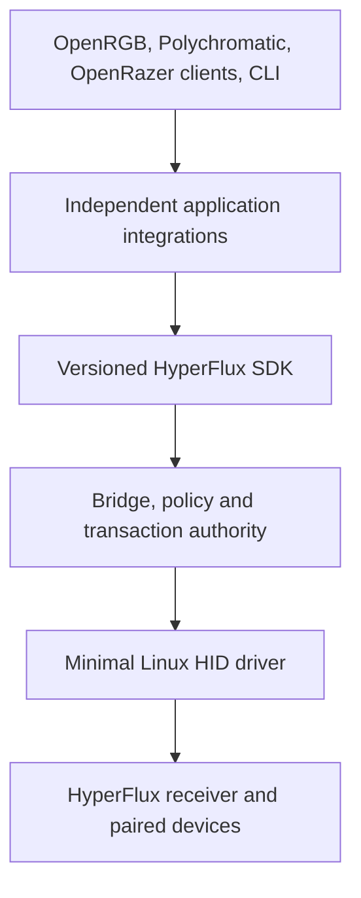

# HyperFlux Next

HyperFlux Next is a clean, universal Linux foundation for devices connected
through the Razer HyperFlux V2 system. It separates hardware transport from
device policy and application presentation so new qualified devices can be
added without rewriting unrelated kernel, bridge, packaging, and UI code.

> [!IMPORTANT]
> This repository is a local architectural reconstruction. It is not a
> published driver, package, release candidate, or authorized GitHub product
> repository. It performs no hardware writes in its current phase.

## Product Direction



The architecture is governed by three rules:

1. Applications describe intent and presentation; they never encode receiver
   reports.
2. The bridge is the sole userspace write authority and owns policy,
   qualification, ownership, scheduling, and structured outcomes.
3. The kernel remains small: it preserves HID input, observes receiver state,
   owns generations and one writer session, and transports bounded envelopes.

The complete governing specification is the
[HyperFlux Next Design Book](docs/architecture/design-book.md). Its enforceable
subset lives in the generated [Architecture Constitution](docs/generated/architecture.md).

## Current Phase

The repository has an implemented, locally verified software foundation. A
release is still blocked on hosted-container evidence, native package lifecycle
evidence, targeted physical qualification, and an explicit publication
decision:

- source repositories are immutable evidence inputs, not templates;
- every subsystem receives an explicit migration decision;
- imported facts retain provenance and evidence links;
- canonical JSON drives generated documentation, language bindings, profile
  catalogs, kernel receiver tables, and composition fixtures;
- the minimal HID module preserves ordinary input, exposes passive observations,
  and compiles warning-fatal against supported local kernel headers without
  loading the module or writing hardware;
- receiver, child, and surface profiles compose independently at runtime;
- every writable capability requires a public physical evidence claim;
- official compatibility names remain zero-write candidates until separately
  qualified;
- unknown or unreviewed source is excluded by default;
- publication requires a separate, explicit authorization after all software
  and targeted hardware gates pass.

Run the complete current verification entry point:

```sh
./hfx verify --all
```

Build and verify the audience-separated documentation portal locally:

```sh
./hfx docs build --output build/portal
./hfx docs verify --site build/portal
```

The generated [GitHub governance reference](docs/generated/github-governance.md)
documents immutable workflow dependencies, branch-protection intent, issue
forms, dependency automation, and every publication interlock. Those files are
ready for review but no remote, Pages deployment, release workflow, or hardware
CI is authorized.

Inspect migration progress without changing files:

```sh
./hfx migration summary
```

Run the canonical read-only semantic comparison against frozen, sanitized
legacy decisions:

```sh
./hfx migration compare \
  --fixture tests/fixtures/shadow/qualified-lifecycle-v1.json \
  --output build/shadow-comparison
```

This compares profile selection, presence, capabilities, transaction
validation, and diagnostic findings. It cannot access hardware or authorize a
release; see the generated [migration shadow reference](docs/generated/migration-shadow.md).

## Repository Map

| Path | Responsibility |
| --- | --- |
| `architecture/` | Machine-readable ownership, invariants, boundaries, and release interlocks |
| `assurance/` | Design coverage, release gates, dependency policy, performance budgets, formal model, and generated SBOM |
| `governance/` | Canonical GitHub policy and non-applicable remote governance plans |
| `.github/` | Generated ownership, contribution forms, dependency policy, and software-only workflows |
| `schemas/` | Versioned schemas for canonical project data |
| `integrations/` | Pinned upstream contracts, coexistence rules, and adapter boundaries |
| `integrations/openrazer/compatibility/` | Optional private OpenRazer-compatible D-Bus provider; never the receiver transport |
| `crates/hfx-domain/` | Generated Rust strong types and validation |
| `crates/hfx-integration-model/` | Generated integration registry and shared application-facing projections |
| `crates/hfx-profiles/` | Generated, queryable Rust hardware profile catalog |
| `crates/hfx-sdk/` | Native application SDK, exact-version channel, and typed client boundary |
| `crates/hfx-runtime/` | Generated Linux runtime constants and validated service configuration |
| `crates/hfx-daemon/` | Production bridge composition, bounded actor, discovery, observations, and restoration scheduling |
| `crates/hfx-ops/` | Doctor, status, configuration migration, package activation, and privacy-safe support tooling |
| `crates/hfx-kernel-transport/` | Generated kernel ABI and isolated userspace transport boundary |
| `profiles/` | Canonical capabilities, evidence claims, composable hardware profiles, and candidates |
| `sdk/` | Generated non-Rust language bindings for integrations |
| `driver/kernel/generated/` | Receiver-only match tables; no child presentation or application policy |
| `driver/kernel/uapi/` | Generated fixed-width Linux userspace ABI; no pointers or product policy |
| `driver/kernel/` | Minimal HID lifecycle, passive observation, writer-session, and validated-envelope transport |
| `runtime/` | Canonical Linux product, service, kernel, operational, and bounded-runtime policy |
| `packaging/generated/` | Generated non-activating systemd, udev, sysusers, tmpfiles, environment, and default configuration assets |
| `uapi/` | Canonical kernel ABI model and bounds |
| `generated/` | Canonical machine artifacts consumed across components |
| `migration/` | Source identities, generated inventories, reviewed subsystem decisions, and shadow source bindings |
| `docs/architecture/` | Human design sources and decisions |
| `docs/generated/` | Deterministic views generated from canonical data |
| `docs/portal.json` | Three-audience local documentation portal authority |
| `tools/hfxdev/` | Bootstrap verification and generation tooling |
| `tests/` | Independent foundation tests |

Future product directories are created only when their owning contract and
tests exist. The engineering and reverse-engineering repositories remain the
authoritative locations for laboratory code, watched coordinators, captures,
and historical proof machinery.

Shared identifiers, state enums, ranges, and wire values are defined once in
[`schemas/domain-catalog.json`](schemas/domain-catalog.json). Rust, C++, Python,
and the [domain reference](docs/generated/domain-types.md) are generated from
that source and compile together during verification.

Hardware truth begins in [`profiles/`](profiles/). The compiler validates every
evidence path against an immutable source inventory, forbids exact keyboard and
mouse combinations, rejects guessed surface USB identities, and grants unknown
children zero writes. Its generated
[supported-hardware reference](docs/generated/supported-hardware.md) keeps
qualified support separate from official compatibility candidates.

Application integration truth begins in
[`integrations/catalog.json`](integrations/catalog.json). It pins the reviewed
OpenRGB, OpenRazer, and Polychromatic contracts, requires SDK-only transport,
and forbids adapters from suppressing unrelated application devices. Its
generated [integration reference](docs/generated/integrations.md) keeps current
implementation state separate from future plans. The shared
[`hfx-integration-model`](crates/hfx-integration-model) projection turns exact
protocol snapshots into tested inventory, controller, ownership, and action
views before any application-specific UI runs; see the
[integration boundary](docs/architecture/integrations.md).
The [OpenRazer compatibility boundary](docs/architecture/openrazer-compatibility.md)
documents the private default identity, isolated legacy mode, qualified method
subset, and non-replay rules.

Development tool versions are recorded in
[`toolchains/pins.json`](toolchains/pins.json). The generated, digest-pinned
[development container](docs/generated/development-environment.md) provisions
those exact tools from one dated Arch snapshot. Run `./hfx upstream prepare`
once to create clean detached checkouts at the application commits in the
integration catalog; verification then stays offline and uses them by default.

## Licensing

Project-owned kernel and core work is licensed under `GPL-2.0-only`.
Cross-application SDKs and application-specific adapters declare compatible
per-file exceptions. Imported material retains its original license and must
pass a provenance and compatibility review before admission. See
[License Decision](LICENSE-DECISION.md).
