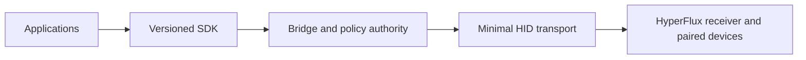

# HyperFlux Next

**Evidence-bound Linux support for devices paired through Razer HyperFlux V2.**

[](https://github.com/offalexjackson777-stack/hyperflux-next/actions/workflows/verification.yml)
[](https://github.com/offalexjackson777-stack/hyperflux-next/actions/workflows/pages.yml)


> [!IMPORTANT]
> **Unreleased and evidence-bound.** The source and generated documentation are
> public for review, but there is no supported package channel or product
> release. Software verification, route qualification, lifecycle evidence, and
> a release decision remain separate facts; one never silently promotes another.

## Start Here

| Destination | Purpose |
| --- | --- |
| [Documentation](https://offalexjackson777-stack.github.io/hyperflux-next/) | Audience-guided product, development, and maintenance documentation |
| [Device Lab](https://offalexjackson777-stack.github.io/hyperflux-next/devices/) | Qualified routes, research candidates, provenance, conflicts, and unknowns |
| [Repository Atlas](https://offalexjackson777-stack.github.io/hyperflux-next/atlas/) | Canonical ownership, dependencies, generated projections, and safe change paths |
| [Repository State](https://offalexjackson777-stack.github.io/hyperflux-next/state/) | Release gates, evidence levels, verification budgets, and current blockers |
| [Installation status](https://offalexjackson777-stack.github.io/hyperflux-next/users/installation.html) | What a future package contains and why installation is not yet offered |
| [Architecture](https://offalexjackson777-stack.github.io/hyperflux-next/developers/architecture.html) | System boundaries and the one-writer transport model |
| [Contributing](CONTRIBUTING.md) | Schema-first changes, evidence expectations, and verification |
| [Security](SECURITY.md) | Private vulnerability reporting and disclosure policy |
| [Roadmap](https://github.com/users/offalexjackson777-stack/projects/1) | Typed issues and qualification work organized in the GitHub Project |

## Architecture



Applications own user interaction, layouts, and effects. The SDK owns the typed
application boundary. The bridge is the sole userspace writer and owns policy,
qualification, scheduling, restoration, and outcomes. The kernel preserves
ordinary HID input and transports bounded generation-bound envelopes.

## Current Readiness

<!-- Generated from assurance/release-gates.json, generated/knowledge/catalog.json, and architecture/repository-atlas.json. -->

| Surface | Current evidence |
| --- | --- |
| Public source and documentation | Authorized pre-release surface; 31 Atlas subsystems; generated Pages only |
| Software verification | 5 of 10 release gates software-satisfied |
| Hardware knowledge | 2 route-qualified profiles; 10 research-only candidates; 191 reviewed facts; 23 explicit gaps |
| Remaining release evidence | 3 physical gate(s); 1 lifecycle gate(s) |
| Product publication | Locked; no release, tag, package channel, or supported-product claim |
| Portal hardware access | Zero hardware writes and zero live device queries |

The compact table is generated by `./hfx generate`. Follow [Repository
State](https://offalexjackson777-stack.github.io/hyperflux-next/state/) for the complete, canonical explanation.

## Choose Your Next Action

| You are... | Go to... |
| --- | --- |
| A first-time visitor | [Product overview](https://offalexjackson777-stack.github.io/hyperflux-next/users/overview.html) and [installation status](https://offalexjackson777-stack.github.io/hyperflux-next/users/installation.html) |
| A developer | [Architecture](https://offalexjackson777-stack.github.io/hyperflux-next/developers/architecture.html), then the [Repository Atlas](https://offalexjackson777-stack.github.io/hyperflux-next/atlas/) |
| A prospective contributor | [CONTRIBUTING.md](CONTRIBUTING.md) and the [issue forms](https://github.com/offalexjackson777-stack/hyperflux-next/issues/new/choose) |
| A hardware tester | [Device Lab](https://offalexjackson777-stack.github.io/hyperflux-next/devices/) and the [device qualification form](https://github.com/offalexjackson777-stack/hyperflux-next/issues/new?template=device_qualification.yml) |
| A maintainer | [Repository State](https://offalexjackson777-stack.github.io/hyperflux-next/state/), [governance](https://offalexjackson777-stack.github.io/hyperflux-next/maintainers/github-governance.html), and the [roadmap](https://github.com/users/offalexjackson777-stack/projects/1) |
| A security reporter | [SECURITY.md](SECURITY.md) and [private vulnerability reporting](https://github.com/offalexjackson777-stack/hyperflux-next/security/advisories/new) |

## Verify A Change

```sh
./hfx generate
./hfx verify --changed-from <commit>
./hfx verify --all
```

Generated files must be reproducible in one pass. Verification is change-aware,
networkless after exact upstream preparation, device-free, and incapable of
granting hardware or release authority.

<details>
<summary>Repository boundaries</summary>

- Unknown devices expose safe identity and passive observations but receive no
  writable capability.
- Imported upstream catalogs contribute provenance-bound knowledge, never raw
  transport authority.
- Release, package, tag, and hardware-writing workflows are absent until a
  separate authorization changes their canonical interlocks.
- The [Repository Atlas](https://offalexjackson777-stack.github.io/hyperflux-next/atlas/) is the authoritative directory map;
  folder READMEs are generated projections of it.

</details>

Project-owned kernel and core work is `GPL-2.0-only`. SDKs and integrations use
declared compatible exceptions. See [LICENSE-DECISION.md](LICENSE-DECISION.md).
