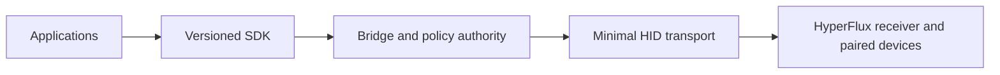

# HyperFlux Next

**Evidence-bound Linux support for devices paired through Razer HyperFlux V2.**

[](https://github.com/offalexjackson777-stack/hyperflux-next/actions/workflows/verification.yml)
[](https://github.com/offalexjackson777-stack/hyperflux-next/actions/workflows/pages.yml)


> [!IMPORTANT]
> **Unreleased and evidence-bound.** Public source is available for review; no supported product release or package channel exists.

## Start

| I need to... | Go to... |
| --- | --- |
| Understand or eventually install HyperFlux | [Documentation](https://offalexjackson777-stack.github.io/hyperflux-next/) and [installation status](https://offalexjackson777-stack.github.io/hyperflux-next/users/installation.html) |
| Check hardware evidence | [Device Lab](https://offalexjackson777-stack.github.io/hyperflux-next/devices/) |
| Understand or change the code | [Architecture](https://offalexjackson777-stack.github.io/hyperflux-next/developers/architecture.html), [Repository Atlas](https://offalexjackson777-stack.github.io/hyperflux-next/atlas/), and [Contributing](CONTRIBUTING.md) |
| Review blockers and evidence | [Repository State](https://offalexjackson777-stack.github.io/hyperflux-next/state/) and [Roadmap](https://github.com/users/offalexjackson777-stack/projects/1) |
| Report a vulnerability | [Security policy](SECURITY.md) and [private reporting](https://github.com/offalexjackson777-stack/hyperflux-next/security/advisories/new) |

## Architecture



Applications own user interaction, layouts, and effects. The SDK owns the typed
application boundary. The bridge is the sole userspace writer and owns policy,
qualification, scheduling, restoration, and outcomes. The kernel preserves
ordinary HID input and transports bounded generation-bound envelopes.

## Current Readiness

<!-- Generated from generated/public-readiness.json. -->

| Surface | Plain-language state |
| --- | --- |
| Product | **Unreleased**: Public source is available for review; no supported product release or package channel exists. |
| Software | 5 of 10 release gates are ready in software. |
| Hardware | 2 receiver routes have bounded physical evidence; 10 candidates remain research only. |
| Remaining evidence | 3 hardware gate and 1 lifecycle gate remain; known gaps stay explicit. |
| Documentation portal | Static and telemetry-free; no live device query or hardware write |

This table and the Pages home consume the same generated projection. [Repository
State](https://offalexjackson777-stack.github.io/hyperflux-next/state/) shows the detailed ledgers without changing the meaning
of these terms.

## Verify A Change

```sh
./hfx generate
./hfx verify --changed-from <commit>
./hfx verify --all
```

Generated files must be reproducible in one pass. Verification is change-aware,
networkless after exact upstream preparation, device-free, and incapable of
granting hardware or release authority.

<details>
<summary>Engineering and publication boundaries</summary>

- Unknown devices expose safe identity and passive observations but receive no
  writable capability.
- Imported upstream catalogs contribute provenance-bound knowledge, never raw
  transport authority.
- Release, package, tag, and hardware-writing workflows are absent until a
  separate authorization changes their canonical interlocks.
- The [Repository Atlas](https://offalexjackson777-stack.github.io/hyperflux-next/atlas/) is the authoritative directory and
  ownership map; folder READMEs are generated projections.

</details>

Project-owned kernel and core work is `GPL-2.0-only`. SDKs and integrations use
declared compatible licenses. See [licensing policy](docs/legal/licensing.md).
