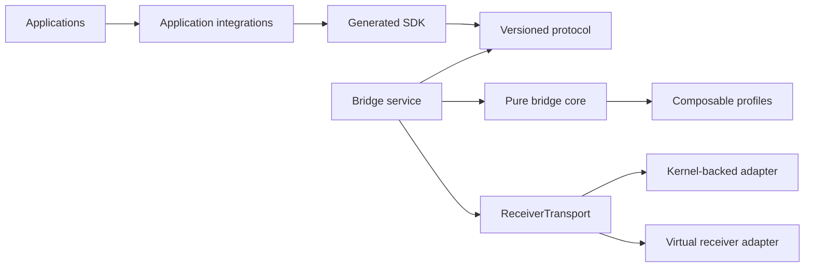
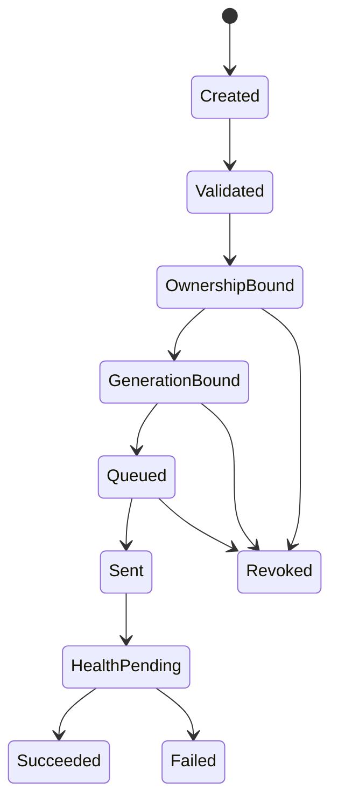

# Bridge Core Boundaries

The HyperFlux bridge is the sole userspace policy and write authority between application SDKs and a generation-bound receiver transport. It does not own application presentation, effects, hardware report layouts, or physical qualification claims.

## Dependency Direction

The protocol, core state machines, and profile registry point inward. Application integrations never become bridge dependencies. Linux ioctl details and raw receiver reports remain behind the concrete kernel adapter.

## Distinct Safety Bindings

The following identities solve different problems and must not be merged:

- receiver generation rejects state from a previous physical connection;
- client identity owns connection-scoped resources;
- lease identity proves current application ownership;
- transaction identity provides idempotent outcome lookup;
- request identity deduplicates one method invocation;
- event stream identity and epoch detect service restart;
- event sequence detects a missed bounded event.

Each qualified profile also has a profile-local runtime digest. It covers
identity authority, compatibility, transport mappings, and capability
contracts, while excluding presentation prose. Updating one device profile
therefore invalidates work bound to that profile without needlessly revoking
unrelated devices; the separate catalog digest still proves whole-catalog
provenance.

A reconnect creates a newer generation and invalidates generation-scoped observations, leases, queued work, and partial restoration. An event from an older generation cannot reactivate itself.

## Connection Sessions

Every accepted bridge connection begins unnegotiated. The only legal first method is `negotiate`, which selects one protocol version and the intersection of offered bridge features. The bridge then issues a protocol session ID and an opaque negotiation token. Every later request carries both values, and methods that contain a client or nested request identity must agree with the negotiated client and outer request envelope.

The exact initial negotiation request is replayable and returns the same server hello without minting new credentials. A different second negotiation on the same connection is rejected. Closing or revoking the connection invalidates its independent internal session ID and authorization epoch, which makes queued work fail its authority recheck even if a client retained old protocol credentials.

Protocol session IDs, negotiation tokens, internal session IDs, and authorization epochs are generated from operating-system entropy. Tokens are treated as credentials: mismatch errors never echo either the supplied or expected value. The connection layer must additionally enforce peer credentials and bounded concurrent sessions; a token does not replace local socket authorization.

The bridge-wide session registry has a fixed capacity and permits one active connection for each client ID. This prevents two connections that chose the same client identity from operating one another's leases. Registration rejects capacity, session-ID collision, and duplicate-client cases without changing existing authority. Disconnect revokes the internal session before releasing client leases and invalidating queued work.

The generated protocol catalog owns request method names, request IDs, session credential access, and feature requirements. Bridge code consumes those generated accessors instead of maintaining a parallel method table. This keeps a future protocol method addition compile-visible and generation-driven.

The connection dispatcher is the only layer that turns a typed RPC request into a method call. It performs negotiation and registry admission, verifies every session-bound envelope, routes only authorized method parameters to an application-neutral backend, and converts failures through the central error catalog. Backend debug text, credentials, payloads, and private paths never become protocol error messages.

Disconnect is ordered deliberately: internal session authority is revoked first, then the backend releases client leases and terminally accounts for queued work. A cleanup failure therefore cannot leave a disconnected client authorized to reach transport. Repeated disconnect is a no-op.

## Local RPC Framing

The Unix transport uses a four-byte unsigned big-endian payload length followed by one JSON protocol document. A clean EOF before any prefix byte ends the connection. A partial prefix, empty frame, partial payload, malformed document, or payload above 1 MiB is a terminal framing error.

The length bound is checked before allocation. Responses are validated and serialized through a bounded writer before any bytes are emitted, then written with complete-write semantics and flushed. Framing errors preserve the I/O stage without including payloads, tokens, or private paths.

Framing is not the SDK contract; generated protocol records are. The connection selects an exact frozen version before any session request is decoded or response is emitted. Version 1 remains read-compatible but cannot submit profileless writes. Version 2 profile-binds writes and conservatively normalizes every `static-lighting` request to semantic Static, including an all-black frame. Version 3 carries explicit per-device Static or Off intent. A payload from an adjacent version is rejected instead of being guessed from fields.

## Transaction Meaning

A transaction moves through declared states:

`Succeeded` means every declared frame received one terminal receiver-transport delivery and required finalization completed. It does not claim that a child applied the frame or that a person observed the intended result. The protocol therefore reports delivered frame count, transport side-effect certainty, whether live transport began, automatic-retry policy, and separate child-application confirmation.

Partial or uncertain transport is never retried automatically. A client resolves an ambiguous response through transaction outcome lookup, not by submitting the write again. A later visible result does not rewrite a terminal timeout history.

## Lifecycle Ingress

The bridge accepts passive lifecycle evidence through one typed, generation-checked ingress. Receiver identity, child identity, endpoint registration, pairing, route, power, sleep, activity, mat contact, freshness, and battery values are distinct observations. Unsupported children remain visible but receive no write authority. A malformed, stale, conflicting, or wrong-generation observation changes neither canonical state nor the event stream.

Receiver events and child events describe different facts. Receiver suspend emits `receiver-suspended` without rewriting retained child endpoint evidence. Child `available`, `sleeping`, `unavailable`, and `unknown` events are emitted only when child evidence changes the corresponding projected presence. Applications combine the receiver lifecycle and child endpoint facts rather than forcing either one to impersonate the other.

Generation activation stages lifecycle, profile qualification, old lease revocation, queued transaction revocation, durable restoration reconciliation, and canonical events before committing any volatile owner. Initial discovery emits `receiver-available`. A replacement emits `generation-replaced`; reconnect after a completed removal additionally emits `receiver-available`. Physical disconnect is two-stage: the first transport-confirmed absence moves the generation to `disconnecting`, revokes live authority, terminally reconciles every durable claim for that generation, and emits `receiver-unavailable`; a later observation retires the generation and its profile binding. Ordinary lifecycle observations cannot enter `disconnecting`, so no adapter can bypass revocation.

## Ownership And Atomicity

Resources are keyed by logical device and generic domain: lighting, settings, or pairing. This supports arbitrary receivers and multiple children without fixed mouse/keyboard slots.

Lease acquisition is atomic. If any requested resource is owned by another client, none are granted. Forced takeover is not part of protocol version 1. Read-only snapshots, telemetry, and diagnostics remain shared.

Battery telemetry is a generation-bound lifecycle fact, not adapter-owned UI state. Reported zero percent remains a real value; unavailable and never observed remain distinct; freshness can become stale without erasing the last value. A receiver-generation replacement clears all battery evidence so a new connection can never inherit telemetry from its predecessor.

Acquire, renew, and release share one bounded client-and-request idempotency history. Exact replay returns the retained result; reuse across methods or with changed content is rejected. Conflict outcomes consume the same bounded history budget as grants, so a stream of losing acquisition requests cannot create unbounded bridge state.

Atomicity describes admission, ownership, ordering, and complete transaction accounting. It does not invent physical rollback or simultaneous visible child application where hardware cannot prove either claim.

## Backpressure

Backpressure is policy-specific:

- current unsent effect frames may be coalesced per resource because an older frame is obsolete;
- static lighting, settings, pairing, and restoration preserve strict order and return busy when their bounded queue cannot accept work;
- one logical device's outage must not stall its sibling;
- event and diagnostic journals are bounded history rings, not work queues;
- logging output is best effort through a bounded nonblocking sink and can never stop transport.

Every deadline uses an injected monotonic clock. Kernel session expiration may use Linux boottime inside the concrete kernel boundary so suspend remains meaningful. Durable capture timestamps use a separate wall-clock boundary.

## Restoration

Persistence stores semantic stable intent and exact profile identity. It never stores a live lease, session authorization, route observation, raw frame, or software-effect phase.

Restoration requires a fresh qualified generation, current routes, a matching profile digest, new ownership, and one durable lifecycle claim. A surviving claim, partial checkpoint, or failed target blocks a false complete result. Software effects remain application computations and restart through the application's saved startup profile.

`DurableRestorationRuntime` is the bridge's one persistence owner and snapshot source. Its generation-retirement operation first consumes an exact retained transaction terminal when one exists, otherwise reconciles the persisted dispatch nonce with transport. Confirmed or possible writes retain their outcome facts. Only a transport `NotObserved` result permits stale invalidation. Sibling claims change through one atomic batch compare-and-set, so a mouse claim cannot retire while its keyboard sibling remains accidentally active because a later file operation failed.

After a definitive version 3 Static transaction succeeds, the bridge captures its explicit Static or Off declarations automatically. An exact terminal replay is idempotent: it neither advances the intent revision nor replaces the original capture time. Capture happens after immutable hardware completion is recorded. A persistence failure is therefore reported as a separate capture result and can never rewrite successful transport truth or authorize another hardware dispatch.

The production persistence adapter keeps one strict, schema-versioned document in a private service-owned directory. It holds an advisory writer lock, rejects symlinks and broadly readable files, bounds bytes and receiver-scoped records, and writes through a same-directory temporary file followed by file sync, atomic replacement, and directory sync. A failure before replacement changes neither disk nor the in-process compare-and-set view. A directory-sync failure reports uncertain durability after advancing the in-process view to the already-visible replacement, so a stale retry conflicts instead of silently replaying an old revision.

## Protocol Evolution

Clients offer a protocol range and optional feature identifiers. The bridge selects one exact version and emits that version's exact record shapes. Hardware capability discovery is separate from protocol feature negotiation.

Values that may exceed IEEE-754's exact integer range, including receiver generations, monotonic instants, event sequences, and stream epochs, use canonical decimal strings on JSON-compatible wire surfaces. They remain bounded integer types inside native implementations.
