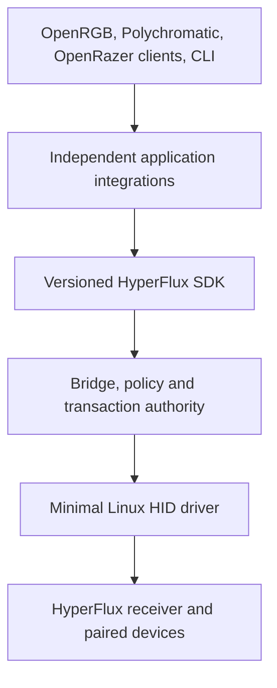
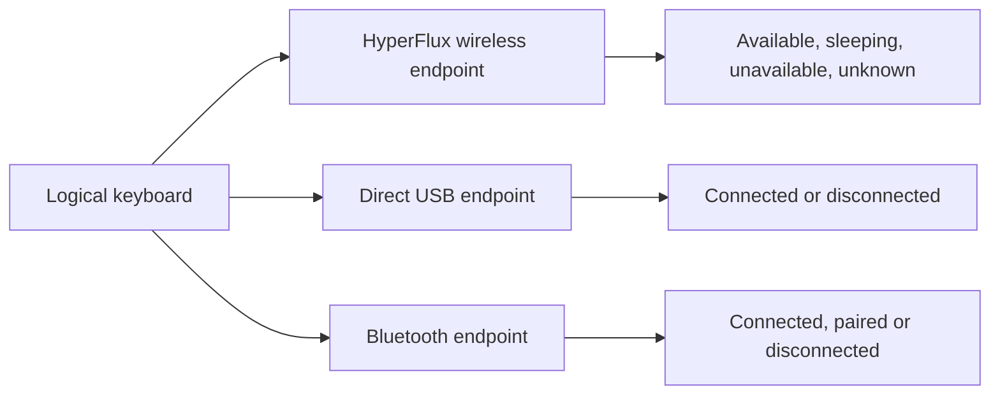
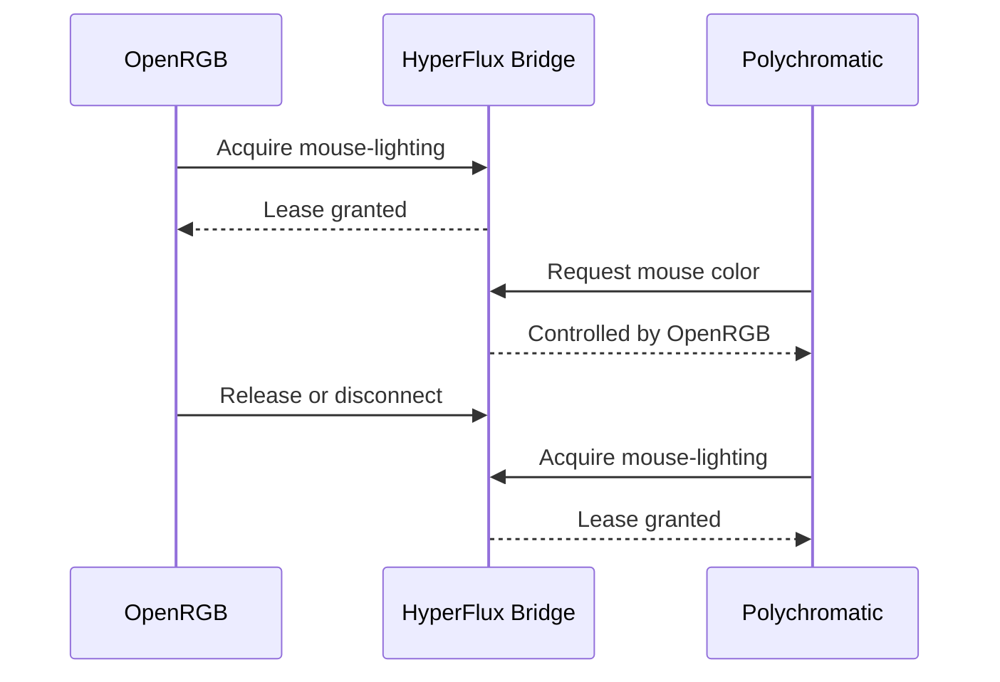

HyperFlux Next: The Complete Design Book
Chapter I: Why The New Repository Exists
1. Purpose
HyperFlux Next should become the universal Linux foundation for devices connected through the HyperFlux V2 system. A normal user should install one package, receive a working driver and bridge, open a supported application, and see the devices that are actually usable. A developer should be able to add support for another qualified device without editing unrelated kernel code, application widgets, packaging scripts, documentation tables, and validation programs independently. The product must remain useful even when the user owns only a mouse, only a keyboard, a different supported model, another mat edition, another Linux distribution, or no RGB application at all.
2. Relationship To The Current Repository
The current repository should be treated as a research archive rather than the architectural template for the future. It contains valuable discoveries, but it also contains designs created while we were still learning what the receiver does. The new repository should inspect each behavior deliberately and ask: is this proven, is its implementation healthy, and does it belong at this architectural layer? Proven behavior may be ported; proven behavior inside weak code should be rewritten; duplicated information should be generated; experiments should be archived; unsafe assumptions should be rejected. This prevents us from carrying yesterday’s uncertainty into tomorrow’s foundation.
3. Knowledge That Must Be Preserved
The migration must preserve receiver report discoveries, validated identities, LED mappings, transaction framing, generation rules, battery observations, sleep and wake behavior, reconnect behavior, package lifecycle findings, OpenRGB layouts, effects tests, persistence results, and every useful failure analysis. Each preserved claim should link to the evidence that justified it. “The mouse has thirteen addressable LEDs” is not merely copied as a number; it is linked to the physical proof that established wheel, logo, strip length, and ordering. This allows future developers to understand why a rule exists instead of treating old constants as mysterious truth.
4. Complexity That Must Not Be Preserved
We should reject duplicated constants, absolute machine paths, exact device combinations, giant application widgets, test scripts bound to one commit layout, manual lists copied from upstream projects, and validation that repeats twenty minutes of work because of one typo. We should also reject hidden coupling, such as changing OpenRGB presentation and accidentally invalidating package manifests or receiver lifecycle tests. The new repository should preserve observable behavior while redesigning the machinery behind it. Compatibility is valuable; accidental structure is not.
Chapter II: The Architectural Foundation
5. Primary Architecture
The system requires a strict direction of responsibility. Applications may ask for capabilities, colors, settings, and state, but they may not know how receiver commands are encoded. The bridge may understand receiver semantics, but it may not contain OpenRGB widgets or Polychromatic presentation.

This structure gives us replaceable applications above a stable hardware foundation. OpenRGB can change its SDK without forcing a kernel redesign, and the receiver protocol can evolve without requiring each application to understand raw reports.
6. Kernel Responsibility
The kernel driver should perform only work that genuinely requires kernel access: binding the verified HID interfaces, preserving ordinary mouse and keyboard input, managing receiver generations, exposing passive observations, enforcing one exclusive writer session, and transporting bounded validated envelopes. It should not implement effects, product names, application ownership, profile migration, user notifications, package repair, or device artwork. Keeping the kernel small reduces crash risk, improves compatibility with future kernels, shortens review, and allows most new functionality to be updated without rebooting.
7. Bridge Responsibility
The bridge is the sole userspace authority allowed to request hardware writes. It validates the active receiver generation, selected profile, device capability, application ownership, request dimensions, transaction rate, and recovery policy. It also combines passive observations into useful state, schedules competing operations, records structured outcomes, and exposes one stable API to integrations. Because every application passes through the same bridge, safety logic is implemented once instead of being separately approximated in OpenRGB, Polychromatic, and command-line utilities.
8. Strong Domain Types
The code should stop passing semantically different facts as interchangeable strings and integers. GenerationId, ReceiverId, LogicalDeviceId, EndpointId, LeaseId, TransactionId, ProductId, BatteryPercent, and DurationMs should be separate types with validation. A battery percentage cannot accidentally become a brightness value; a stale generation cannot be passed where a current generation token is required; a wired PID cannot silently select a wireless carrier. This technique makes illegal operations visible during compilation and turns many runtime surprises into immediate developer errors.
Chapter III: Devices, Routes And Truthful State
9. Logical Devices And Routes
A physical device and the route used to reach it are different objects. One keyboard may be known through HyperFlux wireless, direct USB, and Bluetooth at different times.

This distinction solves the situation where OpenRGB shows a retained HyperFlux wireless controller beside the wired controller even though 2.4 GHz is disabled. The paired keyboard remains part of receiver inventory, but the HyperFlux endpoint should not appear as currently controllable unless the receiver route is usable.
10. Presence State Model
Pairing, availability, sleep, power-off, and connection mode must become separate facts. Paired means the receiver remembers the child. Available means current evidence indicates that operations can reach it. Sleeping means the route remains valid but the child is inactive. Unavailable requires explicit route-loss evidence. Unknown means the available observations cannot justify a stronger claim. The system must record the source and confidence of each transition. Ten minutes without mouse motion may suggest inactivity, but it does not prove that the power switch is off.
11. Wired And Wireless Duplicate Handling
OpenRGB’s native detector owns direct USB devices, while the HyperFlux integration owns receiver-backed endpoints. Deduplication should first correlate stable physical identity, preferably a serial or receiver-provided identifier. Model names and PID families may help explain likely relationships, but they cannot safely merge two devices because a user may own two identical keyboards. When identity is proven and 2.4 GHz is unavailable, only the wired controller should remain. When both routes are genuinely usable, the application should show one logical device with route information or clearly distinguish both endpoints, depending on what OpenRGB’s architecture permits.
12. Composable Hardware Profiles
The current style of one receiver plus one exact keyboard plus one exact mouse should be replaced by composition. A qualified receiver profile describes receiver behavior. Independent child profiles describe each keyboard or mouse. A system profile is assembled at runtime from whichever qualified children are actually paired. This permits mouse-only use, keyboard-only use, another supported mouse with the same receiver, and future devices without creating a combinatorial list of every possible pair.
13. Hard And Cloth Editions
Hard and Cloth should be modeled as surface variants rather than guessed USB identities. If both products use the same receiver protocol and PID, one receiver profile can support both while optional metadata describes the physical surface. If a future observation proves different hardware behavior, a variant profile can override only the relevant properties. The repository must never invent a PID from a product name or use your Hard Edition as proof that every user owns the same edition.
14. Mat And Receiver Presentation
HyperFlux V2 should not appear as an addressable RGB controller unless physical evidence proves that application-controlled lighting exists. The mat and receiver still matter: they provide charging, pairing, transport, receiver identity, and status indicators. Those capabilities belong in the system information model, not necessarily in an RGB device list. Status lighting can eventually receive its own qualified semantic API if it is controllable, but it must not be mixed with mouse and keyboard RGB merely because an upstream page uses ambiguous wording.
Chapter IV: Universality And Qualification
15. Support Levels
Support should be described per capability rather than by one misleading “supported” label. A device may be identified safely while its lighting protocol remains unknown. Another may have qualified lighting but no proven DPI controls. Useful levels include Candidate, Identified, Read-only, Telemetry-qualified, Lighting-qualified, Settings-qualified, Pairing-qualified, and Production-qualified. Applications expose only the capabilities whose required evidence level has been reached. This produces honest partial support instead of either hiding useful devices or pretending every feature works.
16. Unknown Device Behavior
When the receiver reports an unfamiliar child PID, the system should expose safe identity and passive observations where possible. It should not send commands copied from a similar model or assume that matching LED counts imply matching carriers. The user can see that an unqualified device is paired, and a privacy-safe support bundle can collect the information required for investigation. Once its behavior is qualified, adding a profile should unlock capabilities without requiring a new kernel architecture.
17. Capability-Based Programming
Applications should ask the SDK whether a logical device supports per_key_rgb, brightness, battery, dpi_stages, scroll_mode, idle_timeout, or another semantic capability. They should not contain long lists such as “if PID equals this model, show this slider.” Device profiles map verified hardware behavior into capabilities; integrations translate capabilities into their own controls. This is the key to universality because a future device with an already-understood capability can reuse existing application behavior.
Chapter V: Application Integrations
18. OpenRGB Integration
OpenRGB should receive qualified logical controllers through a dedicated integration that depends only on the HyperFlux SDK. OpenRGB remains responsible for its model layouts, LED labels, geometry, color editing, profiles, and application behavior. HyperFlux supplies device identity, active routes, capabilities, ownership, and frame delivery. The HyperFlux information page should show paired inventory and technical state, while OpenRGB’s Devices page should represent controllers that are actually meaningful to control. This division prevents the core from becoming a copy of OpenRGB.
19. OpenRGB Effects
Spectrum Cycling, Rainbow Wave, Breathing, and the broader Effects catalog belong to OpenRGB’s official effect engine. HyperFlux should not recreate or claim those effects. Its responsibility is to transport the generated Direct-mode frames smoothly and safely. The bridge should support batching, frame coalescing, deadlines, and bounded queues so an effect does not become sluggish merely because two devices are updated. Tests should verify animation continuity, sibling-device independence, rescan behavior, reconnect recovery, and transport latency rather than reimplementing effect mathematics.
20. Static Restoration And Effect Persistence
Static-state restoration and software-effect persistence are related but different. The bridge can remember stable Static or Off output and reapply it after receiver reconnect or system resume. A software effect is a running OpenRGB computation, so restarting it requires OpenRGB and its saved Effects startup profile. The exact phase need not be preserved; the effect may restart from its beginning. The user interface should explain this distinction plainly instead of presenting one ambiguous “persistence” switch.
21. OpenRazer Metadata Reuse
OpenRazer contains valuable knowledge about model names, images, matrices, control vocabulary, and user expectations. The new repository should import that information through a pinned, licensed transformation process rather than manually copying it. However, OpenRazer’s direct-device commands do not automatically work through the HyperFlux receiver. Metadata can tell us that a model conceptually supports DPI stages or Smart Reel, but HyperFlux must still understand and qualify the receiver-side operation before exposing it.
22. Optional org.razer Compatibility Provider
Some existing applications understand only OpenRazer’s org.razer D-Bus contract. For those clients, HyperFlux can provide an isolated compatibility service that translates supported methods into SDK operations. It should run on a private or explicitly selected service path, leave the official OpenRazer daemon untouched, and disappear cleanly when unused. It is an interoperability layer, not the central architecture, because forcing every future application through an emulated OpenRazer daemon would constrain HyperFlux to another project’s assumptions.
23. Native Polychromatic Backend
Polychromatic should eventually gain a native HyperFlux backend beside its existing OpenRazer backend. The same window can then show direct OpenRazer devices and receiver-backed HyperFlux devices without replacing the official daemon. Polychromatic continues to own its visual design and device-control experience; the backend translates its actions into SDK capabilities. This is more maintainable than runtime monkeypatching and more universal than pretending the HyperFlux receiver itself is an ordinary OpenRazer USB device.
24. Full Device Settings
Lighting is only one part of the desired experience. Future qualified capabilities may include DPI stages, independent X/Y DPI, polling rate, acceleration, scroll behavior, Smart Reel, idle timeout, low-battery threshold, gaming mode, macros, brightness, charging state, and pairing. Each capability needs a semantic SDK method, receiver translation, validation rules, diagnostics, simulator behavior, and physical evidence. Unsupported controls remain absent or clearly unavailable rather than performing guessed writes.
Chapter VI: Application Ownership
25. Ownership Leases
Multiple applications must not continuously overwrite one another. The bridge should issue renewable leases for specific resources: mouse lighting, keyboard lighting, mouse settings, keyboard settings, and receiver pairing.

Read-only discovery, battery, and connection information remain shared. This prevents write conflicts without making applications blind to one another.
26. Ownership User Experience
When Polychromatic cannot change the mouse because OpenRGB owns it, controls should be disabled with a direct explanation: “Mouse lighting is controlled by OpenRGB. Release HyperFlux control there or close OpenRGB.” The owner should provide a Release control so users do not need to close an application that is also managing their motherboard or RAM. Closing or crashing the owner releases its leases automatically. Forced takeover should initially be prohibited; a later confirmed takeover feature can be considered after its effects on profiles and running animations are understood.
27. Atomic Multi-Device Requests
“Apply All Devices” and synchronized effects must acquire all required resources as one operation. If OpenRGB owns the keyboard but not the mouse, Polychromatic must not update only half of a synchronized request. The bridge either grants the complete lease set or grants none. The same atomic principle applies to transactions: a declared two-frame operation is not considered successful after only one frame. This keeps physical results aligned with what the application promised.
Chapter VII: Schemas, SDKs And Reuse
28. Schema-First Development
Requests, responses, events, profiles, capabilities, errors, diagnostics, evidence, and test definitions should begin as versioned schemas. The schema is reviewed before implementations diverge. It defines required fields, bounded values, compatibility rules, privacy classifications, and extension points. This replaces informal agreements hidden across Rust, C++, Python, shell, YAML, and documentation.
29. Generated Code
A profile compiler should generate Rust types, C++ SDK structures, Python models, kernel tables, validators, documentation tables, and fixtures from canonical sources. Generated files carry source hashes and warnings that they must not be edited manually. CI regenerates them and fails when committed output is stale. A corrected product name or capability identifier is changed once and propagated safely, eliminating the repeated-edit pattern that currently makes small updates dangerous.
30. Stable HyperFlux SDK
The SDK is the supported contract for integrations. It exposes logical-device discovery, endpoint state, capability queries, event subscriptions, telemetry, ownership, lighting, settings, restoration, and diagnostics. It hides socket framing, credentials, raw receiver reports, and bridge-internal actors. C++, Rust, and Python clients should share generated protocol types and language-appropriate convenience APIs. An integration should not need to recreate reconnect handling or parse bridge diagnostics manually.
31. Feature Negotiation
When a client connects, it announces its protocol range and optional features. The bridge responds with the mutually supported version and capabilities. A newer bridge can continue serving an older OpenRGB plugin when the required contract remains compatible. A genuinely incompatible client receives a clear structured error explaining which component needs updating. This prevents a package upgrade from producing unexplained missing devices because two binaries silently disagree about a field.
32. Interfaces And Dependency Injection
Core logic should depend on interfaces such as ReceiverTransport, Clock, ProfileRegistry, LeaseManager, PersistenceStore, and EventSink. Production supplies real implementations; tests supply deterministic substitutes. A simulated clock can advance fourteen minutes instantly. A failing persistence store can reproduce disk errors. A virtual transport can disconnect exactly between two frames. This makes difficult lifecycle paths ordinary automated tests instead of rare manual accidents.
33. Explicit State Machines
Receiver lifecycle, device presence, application ownership, transactions, and restoration should each have declared states and valid transitions. A transaction cannot move from Created directly to Delivered; it must be validated, ownership-bound, generation-bound, queued, sent, and terminally recorded. A stale generation cannot return to Active. A released lease cannot authorize another write. Encoding these rules explicitly makes reviews and tests far more reliable than scattered boolean conditions.
34. Event Subscriptions
Applications should subscribe to typed events such as DeviceAvailable, DeviceSleeping, BatteryUpdated, OwnershipChanged, GenerationReplaced, and TransactionCompleted. They should not poll several files and independently guess what changed. Events contain sequence numbers and current-state references so a client can detect gaps and request a fresh snapshot. This gives application pages immediate, consistent updates while keeping the bridge as the source of truth.
35. Bounded Concurrency And Backpressure
Every queue, journal, event buffer, and effect stream must have a defined limit and overflow policy. High-rate RGB frames may be coalesced when an unsent frame is already obsolete, but configuration operations must retain strict ordering. Slow clients should not block the receiver actor. Logging should never wait forever for an unread pipe. Deadlines, cancellation, priorities, and backpressure turn overload into structured behavior rather than a mysterious freeze.
Chapter VIII: Simulation And Verification
36. Virtual Receiver
The simulator should implement the same interface as the real kernel-backed transport. It can create arbitrary receiver generations, pair different children, emit battery reports, place devices to sleep, remove routes, delay responses, corrupt reports, and simulate suspend. Because the bridge cannot tell whether it is connected to real or virtual transport through the interface, almost every policy path can be tested without hardware.
37. Deterministic Replay
Privacy-safe structured evidence from physical runs becomes immutable replay fixtures. A fixture can reproduce the exact order of observations that once caused a mouse wake failure or a reconnect-generation bug. Simulated time and deterministic random seeds make failures reproducible. When a defect is fixed, its replay becomes a permanent regression test. Raw serials and unnecessary payloads are excluded so fixtures can safely live in the repository.
38. One Verification Entry Point
Developers and CI should use one memorable command:
hfx verify --all
This command invokes a typed dependency graph rather than one enormous script. It understands which tools, builds, schemas, fixtures, packages, applications, and hardware stages are relevant. A failed OpenRGB contract does not erase successful kernel results, and rerunning an unchanged stage reuses its verified artifact.
39. Fast Verification
The fast lane runs formatting, linting, schema validation, generated-file freshness, unit tests, basic property tests, documentation examples, and a representative simulator smoke test. It should complete quickly enough to run before every commit. Fast feedback prevents developers from accumulating ten interacting mistakes before CI finally reports them.
40. Full Software Verification
The full software lane builds supported kernel configurations, Rust services, C++ integrations, Python clients, packages, documentation, and simulator scenarios. It runs application contracts, lifecycle replay, installation, upgrade, rollback, security, license, compatibility, and performance checks. It requires no physical device and should catch the majority of regressions before asking you to observe hardware.
41. Hardware Qualification
Physical testing is reserved for claims software cannot prove: a new command’s visible effect, an unknown PID, LED ordering, sleep timing, battery meaning, charging behavior, or receiver-specific lifecycle behavior. The test planner compares changed source domains with capability evidence and selects only affected physical scenarios. A documentation or widget-layout change must never trigger a twenty-minute passive mouse proof.
42. Watched-Test Application
The physical coordinator should become a proper terminal interface with numbered selections, visible checkpoints, timers, device readiness, and precise instructions. Before any write, it validates repository head, artifacts, manifests, module state, receiver generation, configuration, and authorization. A misspelled answer is rejected locally without repeating a transaction. Interrupted work resumes from the last compatible checkpoint rather than starting from the baseline.
43. Typed Test Metadata
Every test declares its identity, owned domain, required capabilities, hardware requirement, whether it performs writes, expected duration, timeout, dependencies, isolation needs, cache inputs, produced evidence, and resume policy. The orchestrator can then answer why a test is running and what invalidated its cache. This replaces hard-coded test lists spread across workflows and shell scripts.
44. Verification Outputs
Each run produces a concise human report and structured machine artifacts: JSON results, JUnit, GitHub annotations, performance measurements, generated-file checks, package hashes, and an evidence manifest. The manifest binds results to source, schemas, profiles, dependencies, simulator fixtures, compiler versions, and hardware generations where applicable. A green badge then represents a specific reproducible candidate rather than an ambiguous workflow completion.
45. Advanced Testing Methods
Unit tests verify local behavior. Integration tests verify real components together. Contract tests hold every adapter to the same SDK rules. Golden and snapshot tests detect layout or generated-data drift. Property tests generate unexpected combinations. Fuzzers attack parsers and migrations. Mutation testing deliberately changes conditions to prove tests notice. Fault injection introduces crashes, stale sockets, permission errors, delayed responses, disk failures, and interrupted package hooks.
46. Formal Model Checking
Some invariants deserve more than examples. A small TLA+ or equivalent model can explore every ordering of lease acquisition, receiver reconnect, frame delivery, and application crash. It can prove that two applications never simultaneously own one resource or reveal a counterexample where a stale generation writes. Formal methods should target high-risk concurrent protocols, not every ordinary function.
47. Language-Specific Tooling
Rust can use Clippy, nextest, proptest, cargo-fuzz, cargo-mutants, cargo-deny, and API compatibility checks. Python can use uv, Ruff, mypy, pytest, and Hypothesis. C++ can use CMake presets, clang-tidy, sanitizers, and Include-What-You-Use. Kernel code can use sparse, Smatch, Coccinelle, KUnit, KASAN, and KCSAN. Tools are adopted because they catch a defined failure class, not merely because they look advanced.
Chapter IX: User Experience And Diagnostics
48. Declarative Application UI
Application interfaces should consume tested view models rather than interpreting raw bridge responses inside large widget classes. The view model decides labels, available actions, ownership, battery freshness, endpoint state, and support level. The widget renders that model. This allows us to test “keyboard is sleeping and controlled by OpenRGB” without launching hardware, and it prevents a visual redesign from changing receiver policy.
49. Central Error Catalog
Every error should be defined once with a stable identifier, severity, technical cause, user explanation, safe action, verification method, privacy classification, and documentation link. Doctor, service logs, OpenRGB, Polychromatic, package hooks, and support bundles all render the same underlying finding. Changing the explanation for a service failure no longer requires editing five separate implementations.
50. Doctor
Doctor should answer three questions: what works, what requires attention, and what the user should do next. It may automatically repair safe states such as restarting a compatible inactive service. It must not silently unload an active kernel module, reconnect hardware, change pairing, or enable writes. Detailed internals remain available through an explain mode, while the default output stays understandable for an ordinary user.
51. Privacy-Safe Support Bundles
A support preview should describe exactly what would be collected. Bundles include package state, kernel compatibility, bridge state, bounded receiver generations, capability qualification, structured outcomes, and relevant typed errors. They exclude hardware serials, stable host identifiers, private paths, arbitrary terminal history, raw reports, captures, and memory dumps by default. Active queries and hardware writes require separate authorization and are recorded explicitly.
Chapter X: Updates, Packaging And Operations
52. Configuration Migrations
Every persisted configuration carries a schema version. An upgrade computes a migration plan, writes the new version transactionally, validates it, and retains a rollback copy until the new service starts successfully. Unsupported downgrades are explained before damage occurs. Integrations store their own presentation settings separately from bridge safety policy so updating OpenRGB does not rewrite receiver configuration.
53. Package Lifecycle
Packages must be tested from the perspective of an ordinary user: fresh installation, reinstall, compatible update, driver-changing update, service activation, configuration preservation, application adapter reload, rollback, and uninstall. Package hooks should be short and deterministic. Complex decisions belong in a tested activation utility rather than embedded shell fragments.
54. Kernel Activation
Linux cannot replace an in-use kernel module invisibly. When only userspace changes, the bridge may restart automatically. When the installed module differs from the loaded module, the safe choices are reboot or receiver disconnection followed by module reload and reconnection. The package should detect this accurately and present one action. It should never call a required reboot a mysterious service failure.
55. Reproducible Development Environment
Compiler, Rust, Python, CMake, schema compiler, OpenRGB SDK, OpenRazer metadata, and test-tool versions should be pinned. A Nix environment or development container can reproduce the toolchain locally and in CI. Language lockfiles remain committed. Developers can still use their preferred editor, but builds no longer depend on unrecorded tools installed on one workstation.
56. Supply-Chain Security
Dependencies are reviewed, pinned, licensed, and scanned. Packages produce SPDX or CycloneDX software bills of materials. Build provenance records source and toolchain inputs. GitHub Actions are pinned by commit. Future releases can use signed tags, packages, Sigstore attestations, and SLSA provenance. Imported upstream catalogs record source hashes so an unnoticed upstream change cannot silently alter supported devices.
57. Performance Budgets
Performance becomes a tested contract. The repository defines acceptable bridge startup time, transaction latency, effect-frame delay, reconnect recovery, queue depth, CPU use, memory use, binary growth, and package size. A change that technically passes but makes Rainbow Wave visibly stutter is not considered successful. Historical benchmark trends help distinguish noise from meaningful regression.
Chapter XI: Automation, Documentation And GitHub
58. Change-Aware CI
CI should derive affected domains from a maintained dependency graph. A schema change runs every generated binding and adapter contract. A kernel change runs kernel builds, UAPI compatibility, package activation, and relevant lifecycle simulations. A documentation change runs links, examples, generation, accessibility, and portal builds. Change awareness reduces wasted time without weakening required checks.
59. Dependency Updates
Renovate or Dependabot can group related updates and open reviewable pull requests. Each update reports API compatibility, schema changes, license changes, vulnerabilities, binary-size movement, performance impact, and selected tests. Automatic merging is reserved for narrowly defined low-risk updates with complete green evidence. Upstream OpenRGB or OpenRazer metadata changes generate a proposed diff rather than silently entering production.
60. Documentation Portal
The GitHub Pages site should serve different audiences without mixing them. Users receive installation, applications, supported devices, troubleshooting, privacy, and updates. Developers receive architecture, SDK, schemas, state machines, profiles, testing, and contribution guidance. Maintainers receive qualification evidence, release gates, migrations, and operational policy. Support tables and diagrams should be generated from real registries so documentation cannot drift quietly.
61. GitHub Repository Experience
The repository should use meaningful navigation, architecture decision records, issue forms, pull-request impact summaries, CODEOWNERS, protected main, linear history, dependency graphs, private vulnerability reporting, generated changelogs, and compatibility dashboards. Visual polish should communicate live truth rather than decorative badges. A visitor should quickly understand what HyperFlux does, what hardware is qualified, what remains experimental, and how to obtain useful support.
Chapter XII: Migration And Release
62. Migration Ledger
Every old component receives an explicit decision and rationale. The ledger records whether it is ported, rewritten, replaced, generated, archived, rejected, or still under investigation. It links old evidence to new tests and names the new architectural owner. This gives the migration an end condition and prevents forgotten scripts or undocumented behavior from resurfacing later.
63. Shadow Comparison
Before the new system controls real hardware, it can process recorded observations beside the old implementation and compare decisions: selected profiles, presence states, capabilities, transaction validation, and diagnostic findings. Shadow mode remains read-only. The old and new implementations must never both hold the writer session because comparison must not become competing hardware control.
64. Migration Order
The order should reduce uncertainty before moving dangerous behavior.

```mermaid
flowchart LR
    Rules["Architecture constitution"] --> Schemas["Schemas and domain types"]
    Schemas --> Sim["Simulator and replay"]
    Sim --> Core["Bridge and SDK"]
    Core --> RGB["OpenRGB migration"]
    RGB --> Own["Ownership leases"]
    Own --> Poly["Native Polychromatic"]
    Poly --> Compat["OpenRazer compatibility"]
    Compat --> Package["Packaging and diagnostics"]
    Package --> HW["Targeted hardware qualification"]
    HW --> RC["Release candidate"]
```

OpenRGB moves only after the SDK can reproduce existing qualified behavior. Polychromatic begins after ownership exists, preventing two applications from fighting during development.
65. Release Channels
Development builds may contain incomplete migrations. Nightly builds require complete software verification. Release candidates require installation, upgrade, lifecycle, application, and selected physical evidence. Stable releases require approved evidence, reproducible artifacts, documentation, known-limit declarations, and no unresolved release-blocking findings. A successful compile is never treated as publication authorization.
66. Limits And Epistemic Honesty
No architecture can guarantee that every future Razer device uses the same receiver commands. No simulator can prove a previously unseen physical effect. No upstream support list can substitute for transport qualification. The system should make these limits visible through support levels and evidence, not hide them behind broad claims. The innovation is not pretending uncertainty disappears; it is containing uncertainty so one unknown device cannot destabilize proven support.
67. Final Definition Of Success
HyperFlux Next succeeds when the foundation is calm even as integrations evolve. Adding a qualified device usually means adding one composable profile, importing presentation metadata, implementing only genuinely new semantic capabilities, and running a short targeted hardware campaign. OpenRGB, Polychromatic, and OpenRazer-compatible clients coexist through explicit ownership. Wired and wireless routes are truthful. Updates preserve configuration and automate everything that is safe. Most failures are caught by simulation before you touch the receiver. Physical validation proves only the remaining unknowns instead of repeating the entire history of the project.
This is the complete expanded form of all 67 subjects. It explains what each mechanism is, why it exists, how it should behave, how it affects users and developers, and where physical evidence remains necessary.