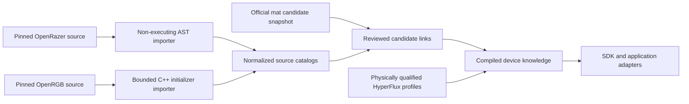

# Device Knowledge Without Transport Guessing

HyperFlux Next keeps three different questions separate:

1. What does a named Razer device document or expose on a direct route?
2. Which exact upstream records correspond to an official HyperFlux V2 candidate?
3. Which operations have been translated and physically qualified through the HyperFlux receiver route?

Those questions are related, but none answers another automatically.

## Canonical Flow



The importers never import Python modules from OpenRazer and never compile or execute OpenRGB source. They parse only bounded metadata forms from exact Git commits declared in `integrations/catalog.json`. Normalized catalogs are committed, so ordinary builds do not use the network.

Candidate membership is also dated. The original 2026-07-13 snapshot remains
in the repository with its original evidence claim. The 2026-07-21 snapshot
declares that it supersedes that snapshot, preserves every prior candidate
verbatim, and adds one newly reviewed candidate. The knowledge-link catalog
names the exact snapshot it compiles, so repeated candidate IDs cannot silently
blend historical observations.

## What A Source Record Proves

A normalized source record may document:

- exact direct, vendor-receiver, or Bluetooth product IDs;
- matrix dimensions, zones, application slots, and layout keys;
- DPI limits and supported polling rates;
- public methods for battery, idle timeout, low-battery threshold, scroll behavior, macros, lighting, and other settings;
- the exact source file, line, revision, digest, and license expression from which each record came.

This is **source-reviewed knowledge**. It is useful for planning, model presentation, semantic SDK design, simulator scenarios, and capability-gap analysis. It is not proof that the same command or packet works through the HyperFlux mat.

## What Enables A Control

`knowledge/capability-map.json` maps upstream method vocabulary to application-neutral semantic capabilities. For example, `get_dpi_xy` and `set_dpi_xy` describe `input.dpi-xy`; they do not prescribe an OpenRazer D-Bus method or an OpenRGB widget.

A setting becomes enabled only when all of these are true:

1. The device is linked explicitly in `knowledge/candidate-links.json`.
2. Runtime identity selects an exact HyperFlux child profile, not merely a similar product name.
3. The child profile lists every capability required by the semantic setting.
4. The normal profile compiler has accepted public, device-scoped physical evidence for every write capability.
5. The bridge exposes the capability through the SDK; application adapters render only that SDK contract.

If any condition is absent, the compiled knowledge can still explain the documented setting, but its `control_state` is `blocked` and names the missing HyperFlux capability.

## Naga V2 Pro Example

The pinned OpenRazer source documents wired `0x00A7` and wireless `0x00A8` variants, a 30,000 DPI limit, DPI stages, polling, battery, charging, idle timeout, low-battery threshold, logo lighting, native effects, and custom frames.

The pinned OpenRGB source independently documents the same PID pair and a two-slot Logo/Numpad presentation. OpenRazer describes a three-slot matrix. The compiler reports that topology disagreement rather than choosing whichever source is convenient.

Today the official mat snapshot can therefore say a Naga V2 Pro is a reviewed candidate with extensive public device knowledge. It cannot expose Naga controls through HyperFlux until an exact receiver-backed identity is observed, its transport families are implemented, and those operations receive physical evidence. Once qualified, every adapter can consume the same semantic SDK capabilities without copying Naga-specific packet logic into OpenRGB, OpenRazer compatibility, or Polychromatic code.

## Update Workflow

The committed catalogs can be reproduced from exact checked-out source trees:

```bash
./hfx knowledge import \
  --openrazer-source /path/to/exact/openrazer/checkout \
  --openrgb-source /path/to/exact/OpenRGB/checkout

./hfx generate
./hfx verify --all
```

An import fails when a checkout revision differs from the integration pin. Verification also fails if a selected OpenRazer method is unmapped, a link references a missing record, a candidate is omitted, generated reports are stale, or source knowledge is accidentally treated as HyperFlux route authority.
