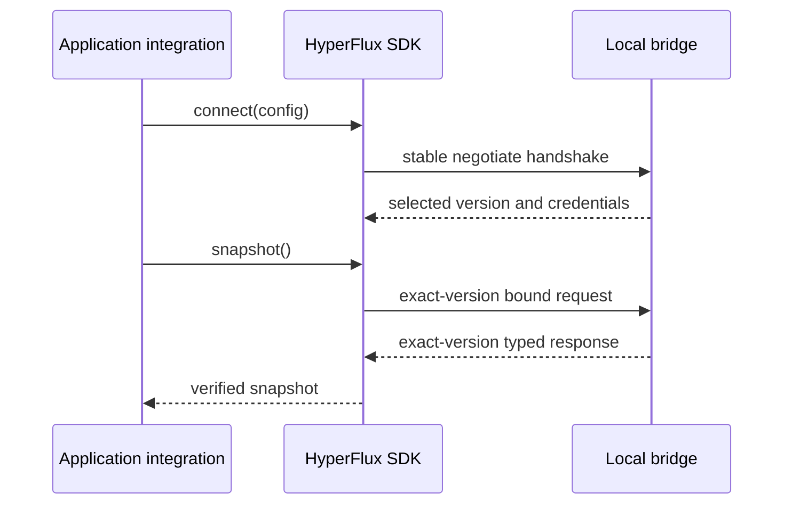

# SDK Boundary

Application integrations use the HyperFlux SDK. They do not construct local RPC frames, retain negotiation credentials, or import bridge implementation modules.

## Responsibilities

The Rust SDK currently owns:

- the stable negotiation handshake and exact-version traffic afterward;
- operating-system-backed request identity generation;
- protocol session ID and negotiation-token binding;
- outer and nested request identity consistency;
- client identity binding for leases, subscriptions, and transactions;
- response request-ID and bridge-instance verification;
- typed clean-EOF, framing, server, and attribution failures;
- ergonomic snapshot, diagnostics, ownership, event, and transaction methods.

The SDK does not own hardware profiles, application presentation, effects, ownership policy, queueing, restoration, or receiver transport. Those remain behind the bridge protocol.

## Failure Rules

A response is accepted only when its request ID matches the outstanding call and its server instance matches the negotiated bridge process. Clean EOF is distinct from malformed or truncated input. A current semantic request that cannot be represented by an older selected protocol fails locally before any prefix or payload byte is written.

Dropping or closing the connection does not transfer authority. The bridge revokes the internal session and then releases associated leases and queued work. Applications reconnect and negotiate new credentials rather than reusing old session values.

## Evolution

The native channel and versioned protocol codec are shared implementation foundations. Generated C++ and future language bindings must reproduce the same public behavior and conformance vectors; they must not call Rust bridge internals or introduce a second protocol definition.
