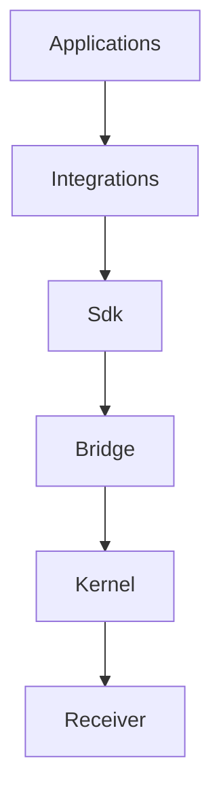

# Architecture Constitution

> Generated by `./hfx generate`. Do not edit manually.

Product phase: **local-foundation-reconstruction**

## Direction Of Responsibility

## Invariants

- `HFX-INV-001` Generic mouse and keyboard input remains independent of optional device-control applications.
- `HFX-INV-002` Applications and integrations never submit raw HID, USB, sysfs, or receiver report payloads.
- `HFX-INV-003` One bridge is the sole userspace authority for receiver writes and one renewable lease owns each writable resource.
- `HFX-INV-004` Every write is bound to a live receiver generation, qualified route, capability, owner, deadline, and transaction.
- `HFX-INV-005` Pairing, route availability, sleep, power state, and connection mode remain separate sourced facts.
- `HFX-INV-006` Unknown devices expose safe identity and passive observations but inherit no writable capability.
- `HFX-INV-007` Receiver, child, and surface profiles compose independently; no exact mouse and keyboard pair is required.
- `HFX-INV-008` Every queue, journal, event buffer, frame stream, message, and retry policy is explicitly bounded.
- `HFX-INV-009` A partial, uncertain, stale-generation, or health-incomplete operation cannot be reported as successful.
- `HFX-INV-010` Canonical schemas own shared facts; generated bindings and documentation may not drift from them.
- `HFX-INV-011` Research code, raw captures, private identifiers, machine paths, and watched mission coordinators are not product dependencies.
- `HFX-INV-012` No compile, test, package, tag, repository, or green workflow alone grants publication authorization.

## Component Ownership

### Applications

Owns: user workflows, presentation, profiles, effects.

Must not own: receiver encoding, qualification, kernel access.

### Integrations

Owns: application contract adaptation, tested view models.

Must not own: raw transport, profile qualification, global retry policy.

### Sdk

Owns: version negotiation, logical devices, routes, capabilities, events, leases, typed errors.

Must not own: application widgets, raw socket framing in callers.

### Bridge

Owns: policy, profile resolution, leases, transactions, scheduling, restoration, diagnostics.

Must not own: application presentation, effect mathematics, arbitrary raw reports.

### Kernel

Owns: HID binding, input preservation, receiver generations, passive observations, exclusive writer session, bounded envelope transport.

Must not own: retail names, effects, profiles, application ownership, package repair.

### Profiles

Owns: identity predicates, qualified capabilities, semantic mappings, evidence references, presentation metadata references.

Must not own: live observations, leases, desired state, guessed commands.

### Verification

Owns: typed test graph, simulator, replay, evidence manifests, change selection.

Must not own: production policy, unbounded reruns, implicit hardware authorization.

## Publication Interlock

Remote repository created: **false**

Publication authorized: **false**

Required gates:

- `HFX-GATE-FOUNDATION`
- `HFX-GATE-SCHEMAS`
- `HFX-GATE-SIMULATION`
- `HFX-GATE-BRIDGE-SDK`
- `HFX-GATE-KERNEL`
- `HFX-GATE-INTEGRATIONS`
- `HFX-GATE-PACKAGING`
- `HFX-GATE-SOFTWARE`
- `HFX-GATE-HARDWARE`
- `HFX-GATE-PUBLICATION-DECISION`
