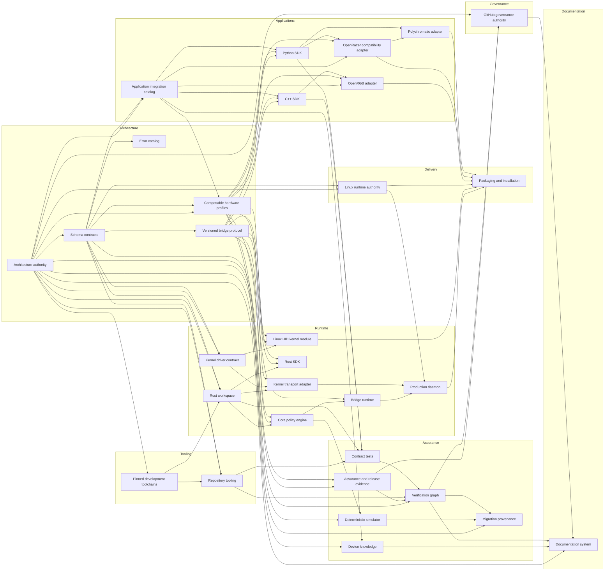

# Repository Atlas

> Generated by `./hfx generate` from `architecture/repository-atlas.json`. Do not edit manually.

The Atlas is a projection of one canonical repository graph. Folder READMEs, dependency views, source-to-generated relationships, and change-impact guidance are generated from the same nodes.

**Subsystems:** 31  
**Categories:** 8  
**Publication state:** `local-unpublished`

## Architecture Map

Arrows run from a dependency to its direct consumer. They describe responsibility and change impact, not runtime calls in every case.

## Subsystem Index

| Subsystem | Category | Status | Depends on | Used by | Verification |
| --- | --- | --- | ---: | ---: | --- |
| [Architecture authority](#architecture) | `architecture` | `policy` | 0 | 13 | `foundation-contracts`, `repository-atlas-contracts` |
| [Schema contracts](#schemas) | `architecture` | `implemented` | 1 | 9 | `schema-contracts`, `repository-atlas-contracts` |
| [Assurance and release evidence](#assurance) | `assurance` | `policy` | 2 | 2 | `assurance-contracts`, `formal-model-contracts` |
| [Application integration catalog](#integrations) | `applications` | `implemented` | 2 | 6 | `integration-contracts` |
| [Composable hardware profiles](#profiles) | `architecture` | `implemented` | 3 | 9 | `profile-contracts` |
| [Device knowledge](#device-knowledge) | `assurance` | `research-boundary` | 2 | 1 | `device-knowledge-contracts` |
| [Versioned bridge protocol](#protocol) | `architecture` | `implemented` | 1 | 7 | `protocol-contracts`, `cpp-sdk-contracts` |
| [OpenRGB adapter](#openrgb-adapter) | `applications` | `implemented` | 3 | 1 | `openrgb-adapter-contracts`, `openrgb-thread-sanitizer` |
| [OpenRazer compatibility adapter](#openrazer-adapter) | `applications` | `implemented` | 3 | 2 | `openrazer-metadata-contracts`, `openrazer-compatibility-contracts` |
| [Polychromatic adapter](#polychromatic-adapter) | `applications` | `implemented` | 2 | 1 | `polychromatic-adapter-contracts` |
| [Rust workspace](#rust-workspace) | `runtime` | `implemented` | 3 | 4 | `rust-format`, `rust-clippy`, `rust-unit` |
| [Core policy engine](#core-runtime) | `runtime` | `implemented` | 3 | 2 | `rust-unit`, `formal-model-contracts` |
| [Bridge runtime](#bridge-runtime) | `runtime` | `implemented` | 2 | 1 | `rust-unit`, `simulator-contracts` |
| [Production daemon](#daemon) | `runtime` | `implemented` | 3 | 1 | `rust-unit`, `package-contracts` |
| [Rust SDK](#rust-sdk) | `runtime` | `implemented` | 3 | 0 | `rust-unit`, `protocol-contracts` |
| [Kernel transport adapter](#kernel-transport) | `runtime` | `implemented` | 3 | 1 | `rust-unit`, `kernel-profile-contracts` |
| [Deterministic simulator](#simulator) | `assurance` | `implemented` | 2 | 1 | `simulator-contracts`, `migration-shadow-contracts` |
| [Kernel driver contract](#driver-contract) | `runtime` | `implemented` | 2 | 2 | `kernel-profile-contracts` |
| [Linux HID kernel module](#kernel-module) | `runtime` | `implemented` | 3 | 1 | `kernel-profile-contracts` |
| [Linux runtime authority](#runtime-config) | `delivery` | `implemented` | 2 | 2 | `foundation-contracts`, `package-contracts` |
| [Packaging and installation](#packaging) | `delivery` | `implemented` | 6 | 0 | `package-contracts` |
| [C++ SDK](#sdk-cpp) | `applications` | `implemented` | 3 | 2 | `cpp-sdk-contracts` |
| [Python SDK](#sdk-python) | `applications` | `implemented` | 3 | 3 | `python-unit`, `protocol-contracts` |
| [Repository tooling](#tooling) | `tooling` | `implemented` | 3 | 2 | `python-unit`, `generated-freshness` |
| [Contract tests](#tests) | `assurance` | `implemented` | 4 | 1 | `python-unit`, `cpp-sdk-contracts`, `rust-unit` |
| [Migration provenance](#migration) | `assurance` | `research-boundary` | 3 | 0 | `foundation-contracts`, `migration-shadow-contracts` |
| [GitHub governance authority](#governance) | `governance` | `policy` | 3 | 1 | `governance-contracts` |
| [Documentation system](#documentation) | `documentation` | `generated` | 4 | 0 | `documentation-portal-contracts`, `repository-atlas-contracts` |
| [Verification graph](#verification) | `assurance` | `implemented` | 4 | 3 | `repository-atlas-contracts`, `python-unit` |
| [Error catalog](#errors) | `architecture` | `implemented` | 1 | 0 | `error-contracts` |
| [Pinned development toolchains](#toolchains) | `tooling` | `policy` | 1 | 2 | `toolchain-contract`, `development-environment-contracts` |

## Subsystems

### Architecture authority

`architecture` · `architecture` · `policy`

Defines product invariants, subsystem direction, ownership boundaries, and the canonical repository graph.

**Owns:** Architecture invariants; Responsibility direction; Repository subsystem graph.

**Must never own:** Runtime state; Hardware observations; Generated implementation bindings.

**Depends on:** None

**Used by:** [Assurance and release evidence](#assurance), [Documentation system](#documentation), [Kernel driver contract](#driver-contract), [GitHub governance authority](#governance), [Application integration catalog](#integrations), [Migration provenance](#migration), [Composable hardware profiles](#profiles), [Linux runtime authority](#runtime-config), [Rust workspace](#rust-workspace), [Schema contracts](#schemas), [Pinned development toolchains](#toolchains), [Repository tooling](#tooling), [Verification graph](#verification)

**Canonical sources:** `architecture/constitution.json`, `architecture/repository-atlas.json`.

**Generated projections:** `architecture/README.md`, `docs/generated/architecture.md`, `docs/generated/repository-atlas.md`.

**Change impact:** Regenerate 3 declared projection(s). Run `foundation-contracts`, `repository-atlas-contracts`. Review direct consumers: Assurance and release evidence, Documentation system, Kernel driver contract, GitHub governance authority, Application integration catalog, Migration provenance, Composable hardware profiles, Linux runtime authority, Rust workspace, Schema contracts, Pinned development toolchains, Repository tooling, Verification graph.

### Schema contracts

`schemas` · `architecture` · `implemented`

Defines strict machine-readable shapes for every shared repository fact and generated contract.

**Owns:** JSON Schema contracts; Cross-language domain catalog; Fail-closed data shapes.

**Must never own:** Runtime policy; Duplicated application presentation; Physical qualification claims.

**Depends on:** [Architecture authority](#architecture)

**Used by:** [Assurance and release evidence](#assurance), [Kernel driver contract](#driver-contract), [Error catalog](#errors), [Application integration catalog](#integrations), [Composable hardware profiles](#profiles), [Versioned bridge protocol](#protocol), [Linux runtime authority](#runtime-config), [Rust workspace](#rust-workspace), [Repository tooling](#tooling)

**Canonical sources:** `schemas/domain-catalog.json`, `schemas/domain-catalog.schema.json`, `schemas/repository-atlas.schema.json`.

**Generated projections:** `schemas/README.md`, `docs/generated/domain-types.md`.

**Change impact:** Regenerate 2 declared projection(s). Run `schema-contracts`, `repository-atlas-contracts`. Review direct consumers: Assurance and release evidence, Kernel driver contract, Error catalog, Application integration catalog, Composable hardware profiles, Versioned bridge protocol, Linux runtime authority, Rust workspace, Repository tooling.

### Assurance and release evidence

`assurance` · `assurance` · `policy`

Owns explicit design coverage, bounded formal models, performance budgets, dependency inventory, and release gates.

**Owns:** Design coverage; Release-gate definitions; Formal and performance assurance.

**Must never own:** Publication authorization; Unreviewed physical claims; Application behavior.

**Depends on:** [Architecture authority](#architecture), [Schema contracts](#schemas)

**Used by:** [GitHub governance authority](#governance), [Verification graph](#verification)

**Canonical sources:** `assurance/design-coverage.json`, `assurance/dependencies.json`, `assurance/formal-model.json`, `assurance/performance-budgets.json`, `assurance/release-gates.json`.

**Generated projections:** `assurance/README.md`, `assurance/generated/hyperflux-next.spdx.json`, `docs/generated/release-gates.md`.

**Change impact:** Regenerate 3 declared projection(s). Run `assurance-contracts`, `formal-model-contracts`. Review direct consumers: GitHub governance authority, Verification graph.

### Application integration catalog

`integrations` · `applications` · `implemented`

Defines application-neutral adapter identities, upstream pins, coexistence rules, and SDK-only transport boundaries.

**Owns:** Integration catalog; Exact upstream revisions; Adapter capability declarations.

**Must never own:** Receiver transport; Profile qualification; Raw HID or USB access.

**Depends on:** [Architecture authority](#architecture), [Schema contracts](#schemas)

**Used by:** [Device knowledge](#device-knowledge), [OpenRazer compatibility adapter](#openrazer-adapter), [OpenRGB adapter](#openrgb-adapter), [Composable hardware profiles](#profiles), [C++ SDK](#sdk-cpp), [Python SDK](#sdk-python)

**Canonical sources:** `integrations/catalog.json`.

**Generated projections:** `integrations/README.md`, `generated/integrations/catalog.json`, `docs/generated/integrations.md`.

**Change impact:** Regenerate 3 declared projection(s). Run `integration-contracts`. Review direct consumers: Device knowledge, OpenRazer compatibility adapter, OpenRGB adapter, Composable hardware profiles, C++ SDK, Python SDK.

### Composable hardware profiles

`profiles` · `architecture` · `implemented`

Composes receiver, surface, and child identities with evidence-bound capabilities and independent routes.

**Owns:** Identity predicates; Qualified capabilities; Evidence references.

**Must never own:** Live observations; Desired lighting state; Guessed commands.

**Depends on:** [Architecture authority](#architecture), [Schema contracts](#schemas), [Application integration catalog](#integrations)

**Used by:** [Core policy engine](#core-runtime), [Device knowledge](#device-knowledge), [Linux HID kernel module](#kernel-module), [OpenRazer compatibility adapter](#openrazer-adapter), [OpenRGB adapter](#openrgb-adapter), [Rust SDK](#rust-sdk), [C++ SDK](#sdk-cpp), [Python SDK](#sdk-python), [Deterministic simulator](#simulator)

**Canonical sources:** `profiles/capabilities.json`, `profiles/evidence/claims.json`, `profiles/receivers/razer-hyperflux-v2-1532-00cf.json`, `profiles/surfaces/razer-hyperflux-v2-hard-edition.json`, `profiles/children/razer-basilisk-v3-pro-35k-00cd.json`, `profiles/children/razer-deathstalker-v2-pro-tkl-0296.json`, `profiles/candidates/razer-hyperflux-v2-2026-07-13.json`, `profiles/candidates/razer-hyperflux-v2-2026-07-21.json`.

**Generated projections:** `profiles/README.md`, `generated/profiles/catalog.json`, `docs/generated/supported-hardware.md`.

**Change impact:** Regenerate 3 declared projection(s). Run `profile-contracts`. Review direct consumers: Core policy engine, Device knowledge, Linux HID kernel module, OpenRazer compatibility adapter, OpenRGB adapter, Rust SDK, C++ SDK, Python SDK, Deterministic simulator.

### Device knowledge

`knowledge` · `assurance` · `research-boundary`

Records provenance-bound candidate facts, semantic capabilities, upstream records, disagreements, and explicit unknowns.

**Owns:** Reviewed device facts; Candidate relationships; Normalized upstream catalogs.

**Must never own:** Receiver write authority; Live device values; Undated compatibility claims.

**Depends on:** [Composable hardware profiles](#profiles), [Application integration catalog](#integrations)

**Used by:** [Documentation system](#documentation)

**Canonical sources:** `knowledge/reviewed-facts.json`, `knowledge/candidate-links.json`, `knowledge/capability-map.json`, `knowledge/upstreams/openrazer.json`, `knowledge/upstreams/openrgb.json`.

**Generated projections:** `knowledge/README.md`, `generated/knowledge/catalog.json`, `docs/generated/device-knowledge.md`.

**Change impact:** Regenerate 3 declared projection(s). Run `device-knowledge-contracts`. Review direct consumers: Documentation system.

### Versioned bridge protocol

`protocol` · `architecture` · `implemented`

Defines bounded request, response, event, negotiation, and compatibility contracts across protocol generations.

**Owns:** Protocol registry; Versioned wire schemas; Compatibility window.

**Must never own:** Application widgets; Kernel HID payloads; Unbounded messages.

**Depends on:** [Schema contracts](#schemas)

**Used by:** [Bridge runtime](#bridge-runtime), [Core policy engine](#core-runtime), [Linux HID kernel module](#kernel-module), [Kernel transport adapter](#kernel-transport), [Rust SDK](#rust-sdk), [C++ SDK](#sdk-cpp), [Python SDK](#sdk-python)

**Canonical sources:** `protocol/registry.json`, `protocol/v1/catalog.json`, `protocol/v2/catalog.json`, `protocol/v3/catalog.json`, `protocol/v4/catalog.json`, `protocol/v5/catalog.json`.

**Generated projections:** `protocol/README.md`, `docs/generated/bridge-protocol.md`, `crates/hfx-protocol/src/generated_versions.rs`.

**Change impact:** Regenerate 3 declared projection(s). Run `protocol-contracts`, `cpp-sdk-contracts`. Review direct consumers: Bridge runtime, Core policy engine, Linux HID kernel module, Kernel transport adapter, Rust SDK, C++ SDK, Python SDK.

### OpenRGB adapter

`integrations/openrgb` · `applications` · `implemented`

Projects qualified SDK devices into native OpenRGB controllers while preserving upstream presentation metadata.

**Owns:** OpenRGB controller projection; UI coordination; Bounded dispatch queue.

**Must never own:** Receiver encoding; Qualification policy; Direct USB access.

**Depends on:** [Application integration catalog](#integrations), [Composable hardware profiles](#profiles), [C++ SDK](#sdk-cpp)

**Used by:** [Packaging and installation](#packaging)

**Canonical sources:** `integrations/openrgb/CMakeLists.txt`, `integrations/openrgb/src/openrgb_plugin.cpp`, `integrations/openrgb/src/runtime_core.cpp`.

**Generated projections:** `integrations/openrgb/README.md`.

**Change impact:** Regenerate 1 declared projection(s). Run `openrgb-adapter-contracts`, `openrgb-thread-sanitizer`. Review direct consumers: Packaging and installation.

### OpenRazer compatibility adapter

`integrations/openrazer` · `applications` · `implemented`

Provides an isolated compatibility surface for legacy OpenRazer clients without impersonating the system daemon globally.

**Owns:** Private compatibility session; OpenRazer metadata import; Legacy client translation.

**Must never own:** Global D-Bus names; Receiver transport; OpenRazer support authority.

**Depends on:** [Application integration catalog](#integrations), [Composable hardware profiles](#profiles), [Python SDK](#sdk-python)

**Used by:** [Packaging and installation](#packaging), [Polychromatic adapter](#polychromatic-adapter)

**Canonical sources:** `integrations/openrazer/import.json`, `integrations/openrazer/metadata.json`, `integrations/openrazer/compatibility.json`.

**Generated projections:** `integrations/openrazer/README.md`, `sdk/python/hyperflux_sdk/generated/openrazer_metadata.py`.

**Change impact:** Regenerate 2 declared projection(s). Run `openrazer-metadata-contracts`, `openrazer-compatibility-contracts`. Review direct consumers: Packaging and installation, Polychromatic adapter.

### Polychromatic adapter

`integrations/polychromatic` · `applications` · `implemented`

Exposes HyperFlux-backed devices to Polychromatic through a native bounded backend and explicit coexistence policy.

**Owns:** Polychromatic backend projection; Client state mapping; Backend discovery patch.

**Must never own:** OpenRazer global policy; Raw receiver access; Profile qualification.

**Depends on:** [OpenRazer compatibility adapter](#openrazer-adapter), [Python SDK](#sdk-python)

**Used by:** [Packaging and installation](#packaging)

**Canonical sources:** `integrations/polychromatic/pyproject.toml`, `integrations/polychromatic/hyperflux_polychromatic/backend.py`, `integrations/polychromatic/patches/0001-discover-native-backends.patch`.

**Generated projections:** `integrations/polychromatic/README.md`.

**Change impact:** Regenerate 1 declared projection(s). Run `polychromatic-adapter-contracts`. Review direct consumers: Packaging and installation.

### Rust workspace

`crates` · `runtime` · `implemented`

Coordinates the Rust dependency graph and compile-time ownership boundaries across production and simulation crates.

**Owns:** Workspace membership; Shared dependency versions; Rust build graph.

**Must never own:** Crate-specific policy; Generated domain authority; Hardware qualification.

**Depends on:** [Architecture authority](#architecture), [Schema contracts](#schemas), [Pinned development toolchains](#toolchains)

**Used by:** [Core policy engine](#core-runtime), [Kernel transport adapter](#kernel-transport), [Rust SDK](#rust-sdk), [Contract tests](#tests)

**Canonical sources:** `Cargo.toml`, `Cargo.lock`.

**Generated projections:** `crates/README.md`.

**Change impact:** Regenerate 1 declared projection(s). Run `rust-format`, `rust-clippy`, `rust-unit`. Review direct consumers: Core policy engine, Kernel transport adapter, Rust SDK, Contract tests.

### Core policy engine

`crates/hfx-core` · `runtime` · `implemented`

Owns lifecycle policy, receiver registry, leases, transactions, restoration intent, and typed diagnostics.

**Owns:** Core state machines; Lease and transaction policy; Restoration intent.

**Must never own:** Socket framing; Kernel I/O; Application presentation.

**Depends on:** [Rust workspace](#rust-workspace), [Composable hardware profiles](#profiles), [Versioned bridge protocol](#protocol)

**Used by:** [Bridge runtime](#bridge-runtime), [Deterministic simulator](#simulator)

**Canonical sources:** `crates/hfx-core/Cargo.toml`, `crates/hfx-core/src/lib.rs`, `crates/hfx-core/src/coordinator.rs`.

**Generated projections:** `crates/hfx-core/README.md`.

**Change impact:** Regenerate 1 declared projection(s). Run `rust-unit`, `formal-model-contracts`. Review direct consumers: Bridge runtime, Deterministic simulator.

### Bridge runtime

`crates/hfx-bridge` · `runtime` · `implemented`

Adapts the core policy engine to sessions, persistence, subscriptions, snapshots, and bounded RPC dispatch.

**Owns:** Bridge actors; Session registry; Persistence and RPC adaptation.

**Must never own:** Core policy duplication; Kernel report encoding; Application-specific effects.

**Depends on:** [Core policy engine](#core-runtime), [Versioned bridge protocol](#protocol)

**Used by:** [Production daemon](#daemon)

**Canonical sources:** `crates/hfx-bridge/Cargo.toml`, `crates/hfx-bridge/src/lib.rs`, `crates/hfx-bridge/src/rpc.rs`.

**Generated projections:** `crates/hfx-bridge/README.md`.

**Change impact:** Regenerate 1 declared projection(s). Run `rust-unit`, `simulator-contracts`. Review direct consumers: Production daemon.

### Production daemon

`crates/hfx-daemon` · `runtime` · `implemented`

Composes production discovery, configuration, authority, service lifecycle, logging, and restoration around the bridge.

**Owns:** Production composition root; Service lifecycle; Privilege and socket setup.

**Must never own:** Core state-machine policy; Application UI; Raw application commands.

**Depends on:** [Bridge runtime](#bridge-runtime), [Kernel transport adapter](#kernel-transport), [Linux runtime authority](#runtime-config)

**Used by:** [Packaging and installation](#packaging)

**Canonical sources:** `crates/hfx-daemon/Cargo.toml`, `crates/hfx-daemon/src/main.rs`, `crates/hfx-daemon/src/production.rs`.

**Generated projections:** `crates/hfx-daemon/README.md`.

**Change impact:** Regenerate 1 declared projection(s). Run `rust-unit`, `package-contracts`. Review direct consumers: Packaging and installation.

### Rust SDK

`crates/hfx-sdk` · `runtime` · `implemented`

Provides the typed Rust client contract used by production integrations and internal consumers.

**Owns:** Rust client API; Identity and channel adaptation; Typed SDK errors.

**Must never own:** Application presentation; Raw receiver reports; Bridge policy.

**Depends on:** [Rust workspace](#rust-workspace), [Versioned bridge protocol](#protocol), [Composable hardware profiles](#profiles)

**Used by:** None

**Canonical sources:** `crates/hfx-sdk/Cargo.toml`, `crates/hfx-sdk/src/lib.rs`, `crates/hfx-sdk/src/client.rs`.

**Generated projections:** `crates/hfx-sdk/README.md`.

**Change impact:** Regenerate 1 declared projection(s). Run `rust-unit`, `protocol-contracts`. No direct subsystem consumer is declared; verify repository-facing outputs.

### Kernel transport adapter

`crates/hfx-kernel-transport` · `runtime` · `implemented`

Adapts the generated kernel UAPI into bounded Rust observation, routing, and envelope I/O.

**Owns:** Kernel device I/O; UAPI encoding; Receiver route adaptation.

**Must never own:** Qualification policy; Application identity; Unbounded raw reports.

**Depends on:** [Rust workspace](#rust-workspace), [Kernel driver contract](#driver-contract), [Versioned bridge protocol](#protocol)

**Used by:** [Production daemon](#daemon)

**Canonical sources:** `crates/hfx-kernel-transport/Cargo.toml`, `crates/hfx-kernel-transport/src/lib.rs`, `crates/hfx-kernel-transport/src/transport.rs`.

**Generated projections:** `crates/hfx-kernel-transport/README.md`, `crates/hfx-kernel-transport/src/generated.rs`.

**Change impact:** Regenerate 2 declared projection(s). Run `rust-unit`, `kernel-profile-contracts`. Review direct consumers: Production daemon.

### Deterministic simulator

`crates/hfx-sim` · `assurance` · `implemented`

Exercises generations, failures, persistence, restoration, replay, and migration shadows without hardware.

**Owns:** Virtual receiver; Deterministic replay; Failure injection.

**Must never own:** Production policy forks; Hardware claims; Unbounded time.

**Depends on:** [Core policy engine](#core-runtime), [Composable hardware profiles](#profiles)

**Used by:** [Migration provenance](#migration)

**Canonical sources:** `crates/hfx-sim/Cargo.toml`, `crates/hfx-sim/src/lib.rs`, `crates/hfx-sim/src/engine.rs`.

**Generated projections:** `crates/hfx-sim/README.md`.

**Change impact:** Regenerate 1 declared projection(s). Run `simulator-contracts`, `migration-shadow-contracts`. Review direct consumers: Migration provenance.

### Kernel driver contract

`driver` · `runtime` · `implemented`

Defines the generated userspace ABI and the strict boundary around the in-kernel receiver transport.

**Owns:** Kernel UAPI authority; Driver source boundary; Session-device contract.

**Must never own:** Retail presentation; Effects; Application ownership.

**Depends on:** [Architecture authority](#architecture), [Schema contracts](#schemas)

**Used by:** [Linux HID kernel module](#kernel-module), [Kernel transport adapter](#kernel-transport)

**Canonical sources:** `uapi/kernel-uapi.json`.

**Generated projections:** `driver/README.md`, `driver/kernel/uapi/hyperflux_next.h`, `docs/generated/kernel-uapi.md`.

**Change impact:** Regenerate 3 declared projection(s). Run `kernel-profile-contracts`. Review direct consumers: Linux HID kernel module, Kernel transport adapter.

### Linux HID kernel module

`driver/kernel` · `runtime` · `implemented`

Binds the receiver, preserves generic input, records passive observations, and transports bounded generation-scoped envelopes.

**Owns:** HID binding; Passive receiver observations; Exclusive session enforcement.

**Must never own:** Retail names; Profiles and effects; Package repair.

**Depends on:** [Kernel driver contract](#driver-contract), [Composable hardware profiles](#profiles), [Versioned bridge protocol](#protocol)

**Used by:** [Packaging and installation](#packaging)

**Canonical sources:** `driver/kernel/Makefile`, `driver/kernel/hyperflux-next-core.c`, `driver/kernel/hyperflux-next-session.c`, `driver/kernel/hyperflux-next-transport.c`.

**Generated projections:** `driver/kernel/README.md`, `driver/kernel/generated/hyperflux_receiver_profiles.inc`, `driver/kernel/hyperflux-next-version.h`.

**Change impact:** Regenerate 3 declared projection(s). Run `kernel-profile-contracts`. Review direct consumers: Packaging and installation.

### Linux runtime authority

`runtime` · `delivery` · `implemented`

Defines package version, service identities, filesystem paths, permissions, activation, and runtime defaults once.

**Owns:** Linux runtime names; Service and path constants; Activation policy.

**Must never own:** Package-format commands; Hardware qualification; Application effects.

**Depends on:** [Architecture authority](#architecture), [Schema contracts](#schemas)

**Used by:** [Production daemon](#daemon), [Packaging and installation](#packaging)

**Canonical sources:** `runtime/linux.json`.

**Generated projections:** `runtime/README.md`, `docs/generated/linux-runtime.md`, `packaging/generated/runtime.env`.

**Change impact:** Regenerate 3 declared projection(s). Run `foundation-contracts`, `package-contracts`. Review direct consumers: Production daemon, Packaging and installation.

### Packaging and installation

`packaging` · `delivery` · `implemented`

Builds reproducible distribution artifacts and a canonical installed root from explicit manifests.

**Owns:** Install manifest; Distribution projections; Reproducible package inventory.

**Must never own:** Runtime naming duplicates; Hidden post-install writes; Publication authorization.

**Depends on:** [Production daemon](#daemon), [Linux HID kernel module](#kernel-module), [Linux runtime authority](#runtime-config), [OpenRGB adapter](#openrgb-adapter), [OpenRazer compatibility adapter](#openrazer-adapter), [Polychromatic adapter](#polychromatic-adapter)

**Used by:** None

**Canonical sources:** `packaging/install.json`, `packaging/distributions.json`.

**Generated projections:** `packaging/README.md`, `packaging/generated/install-plan.json`, `docs/generated/distributions.md`.

**Change impact:** Regenerate 3 declared projection(s). Run `package-contracts`. No direct subsystem consumer is declared; verify repository-facing outputs.

### C++ SDK

`sdk/cpp` · `applications` · `implemented`

Provides typed C++ bridge access and generated contracts for native application adapters.

**Owns:** C++ client API; C++ channel and recovery; Generated C++ bindings.

**Must never own:** OpenRGB widgets; Raw receiver transport; Independent schema truth.

**Depends on:** [Versioned bridge protocol](#protocol), [Composable hardware profiles](#profiles), [Application integration catalog](#integrations)

**Used by:** [OpenRGB adapter](#openrgb-adapter), [Contract tests](#tests)

**Canonical sources:** `sdk/cpp/CMakeLists.txt`, `sdk/cpp/include/hyperflux/sdk.hpp`, `sdk/cpp/src/client.cpp`.

**Generated projections:** `sdk/cpp/README.md`, `sdk/cpp/include/hyperflux/generated/domain_types.hpp`, `sdk/cpp/include/hyperflux/generated/profile_catalog.hpp`.

**Change impact:** Regenerate 3 declared projection(s). Run `cpp-sdk-contracts`. Review direct consumers: OpenRGB adapter, Contract tests.

### Python SDK

`sdk/python` · `applications` · `implemented`

Provides typed Python bridge access and generated contracts for scripting and Python application adapters.

**Owns:** Python client API; Python lighting and recovery; Generated Python bindings.

**Must never own:** Application-specific policy; Raw receiver transport; Independent schema truth.

**Depends on:** [Versioned bridge protocol](#protocol), [Composable hardware profiles](#profiles), [Application integration catalog](#integrations)

**Used by:** [OpenRazer compatibility adapter](#openrazer-adapter), [Polychromatic adapter](#polychromatic-adapter), [Contract tests](#tests)

**Canonical sources:** `sdk/python/pyproject.toml`, `sdk/python/hyperflux_sdk/client.py`, `sdk/python/hyperflux_sdk/lighting.py`.

**Generated projections:** `sdk/python/README.md`, `sdk/python/hyperflux_sdk/generated/domain_types.py`, `sdk/python/hyperflux_sdk/generated/profile_catalog.py`.

**Change impact:** Regenerate 3 declared projection(s). Run `python-unit`, `protocol-contracts`. Review direct consumers: OpenRazer compatibility adapter, Polychromatic adapter, Contract tests.

### Repository tooling

`tools` · `tooling` · `implemented`

Provides the single developer CLI, canonical loaders, deterministic generators, portal builder, and verification orchestration.

**Owns:** Developer command surface; Canonical data loaders; Deterministic generation.

**Must never own:** Duplicate domain facts; Implicit hardware authorization; Hidden network access.

**Depends on:** [Architecture authority](#architecture), [Schema contracts](#schemas), [Pinned development toolchains](#toolchains)

**Used by:** [Contract tests](#tests), [Verification graph](#verification)

**Canonical sources:** `hfx`, `tools/hfxdev/cli.py`, `tools/hfxdev/render.py`, `tools/hfxdev/verify.py`.

**Generated projections:** `tools/README.md`.

**Change impact:** Regenerate 1 declared projection(s). Run `python-unit`, `generated-freshness`. Review direct consumers: Contract tests, Verification graph.

### Contract tests

`tests` · `assurance` · `implemented`

Holds language-specific, cross-language, fixture, lifecycle, accessibility, and change-impact tests.

**Owns:** Focused contract tests; Sanitized fixtures; Cross-language smoke programs.

**Must never own:** Production policy; Canonical facts; Physical evidence claims.

**Depends on:** [Repository tooling](#tooling), [Rust workspace](#rust-workspace), [C++ SDK](#sdk-cpp), [Python SDK](#sdk-python)

**Used by:** [Verification graph](#verification)

**Canonical sources:** `tests/test_foundation.py`, `tests/test_portal.py`, `tests/test_testgraph.py`.

**Generated projections:** `tests/README.md`, `tests/fixtures/generated/profile-compositions.json`.

**Change impact:** Regenerate 2 declared projection(s). Run `python-unit`, `cpp-sdk-contracts`, `rust-unit`. Review direct consumers: Verification graph.

### Migration provenance

`migration` · `assurance` · `research-boundary`

Records exact legacy sources, inventories, dispositions, and read-only semantic shadow comparisons.

**Owns:** Source inventories; Migration disposition ledger; Shadow comparison provenance.

**Must never own:** Copied legacy authority; Raw private captures; Production hardware decisions.

**Depends on:** [Architecture authority](#architecture), [Deterministic simulator](#simulator), [Verification graph](#verification)

**Used by:** None

**Canonical sources:** `migration/sources.json`, `migration/ledger.json`, `migration/inventory/engineering-laboratory.json`, `migration/inventory/engineering-protected-main.json`, `migration/inventory/reverse-engineering-archive.json`.

**Generated projections:** `migration/README.md`, `docs/generated/migration-ledger.md`, `docs/generated/migration-shadow.md`.

**Change impact:** Regenerate 3 declared projection(s). Run `foundation-contracts`, `migration-shadow-contracts`. No direct subsystem consumer is declared; verify repository-facing outputs.

### GitHub governance authority

`governance` · `governance` · `policy`

Defines repository ownership, immutable automation, issue intake, dependency policy, and publication locks from one authority.

**Owns:** GitHub governance policy; Required-check plan; Generated community files.

**Must never own:** Remote mutation authorization; Release approval; External-app installation.

**Depends on:** [Architecture authority](#architecture), [Assurance and release evidence](#assurance), [Verification graph](#verification)

**Used by:** [Documentation system](#documentation)

**Canonical sources:** `governance/github.json`.

**Generated projections:** `governance/README.md`, `governance/generated/github-protection-plan.json`, `docs/generated/github-governance.md`.

**Change impact:** Regenerate 3 declared projection(s). Run `governance-contracts`. Review direct consumers: Documentation system.

### Documentation system

`docs` · `documentation` · `generated`

Combines reviewed narrative sources with generated technical truth into an offline, audience-oriented portal.

**Owns:** Portal information architecture; Reviewed narrative documentation; Offline presentation.

**Must never own:** Duplicated canonical facts; Live hardware claims in static pages; Publication authorization.

**Depends on:** [Architecture authority](#architecture), [Device knowledge](#device-knowledge), [Verification graph](#verification), [GitHub governance authority](#governance)

**Used by:** None

**Canonical sources:** `docs/portal.json`, `docs/user/overview.md`, `docs/architecture/design-book.md`.

**Generated projections:** `docs/README.md`, `docs/generated/repository-atlas.md`.

**Change impact:** Regenerate 2 declared projection(s). Run `documentation-portal-contracts`, `repository-atlas-contracts`. No direct subsystem consumer is declared; verify repository-facing outputs.

### Verification graph

`verification` · `assurance` · `implemented`

Defines typed verification nodes, dependencies, lanes, capabilities, side effects, evidence, timing, and change selection.

**Owns:** Verification node catalog; Lane dependency graph; Evidence declarations.

**Must never own:** Production policy; Implicit retries; Hardware authorization.

**Depends on:** [Architecture authority](#architecture), [Assurance and release evidence](#assurance), [Repository tooling](#tooling), [Contract tests](#tests)

**Used by:** [Documentation system](#documentation), [GitHub governance authority](#governance), [Migration provenance](#migration)

**Canonical sources:** `verification/tests.json`.

**Generated projections:** `verification/README.md`, `docs/generated/verification.md`.

**Change impact:** Regenerate 2 declared projection(s). Run `repository-atlas-contracts`, `python-unit`. Review direct consumers: Documentation system, GitHub governance authority, Migration provenance.

### Error catalog

`errors` · `architecture` · `implemented`

Defines stable typed error identities, user-safe messages, remediation, and cross-language mappings.

**Owns:** Error identifiers; User remediation text; Error severity and domain.

**Must never own:** Ad hoc application-only errors; Private diagnostics; Transport policy.

**Depends on:** [Schema contracts](#schemas)

**Used by:** None

**Canonical sources:** `errors/catalog.json`.

**Generated projections:** `errors/README.md`, `docs/generated/error-catalog.md`, `crates/hfx-errors/src/generated.rs`.

**Change impact:** Regenerate 3 declared projection(s). Run `error-contracts`. No direct subsystem consumer is declared; verify repository-facing outputs.

### Pinned development toolchains

`toolchains` · `tooling` · `policy`

Pins compiler, interpreter, upstream checkout, and development-container identities for reproducible local verification.

**Owns:** Toolchain versions; Development environment pins; Capability discovery inputs.

**Must never own:** Runtime dependencies; Automatic remote mutation; Unpinned downloads.

**Depends on:** [Architecture authority](#architecture)

**Used by:** [Rust workspace](#rust-workspace), [Repository tooling](#tooling)

**Canonical sources:** `toolchains/pins.json`, `toolchains/development-environment.json`.

**Generated projections:** `toolchains/README.md`, `docs/generated/development-environment.md`, `.devcontainer/Containerfile`.

**Change impact:** Regenerate 3 declared projection(s). Run `toolchain-contract`, `development-environment-contracts`. Review direct consumers: Rust workspace, Repository tooling.

