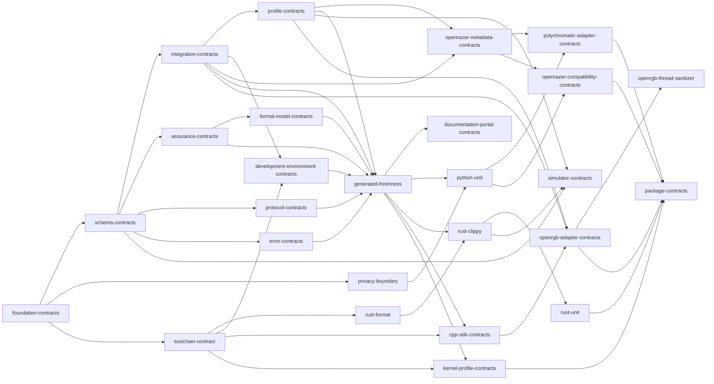

# Verification Graph

> Generated by `./hfx generate`. Do not edit manually.

The catalog contains trusted runner identifiers, not executable command strings.
Every current node is software-only and has zero hardware-write authority.

| Order | Test | Domain | Hardware | Writes | Timeout | Resume |
| ---: | --- | --- | --- | --- | ---: | --- |
| 1 | `foundation-contracts` | `architecture` | `none` | `false` | 10s | `reuse-verified` |
| 2 | `schema-contracts` | `schemas` | `none` | `false` | 10s | `reuse-verified` |
| 3 | `privacy-boundary` | `security` | `none` | `false` | 15s | `rerun` |
| 4 | `toolchain-contract` | `toolchains` | `none` | `false` | 20s | `reuse-verified` |
| 5 | `integration-contracts` | `integrations` | `none` | `false` | 10s | `reuse-verified` |
| 6 | `assurance-contracts` | `assurance` | `none` | `false` | 15s | `reuse-verified` |
| 7 | `protocol-contracts` | `protocol` | `none` | `false` | 10s | `reuse-verified` |
| 8 | `error-contracts` | `errors` | `none` | `false` | 10s | `reuse-verified` |
| 9 | `rust-format` | `rust` | `none` | `false` | 60s | `rerun` |
| 10 | `formal-model-contracts` | `verification` | `none` | `false` | 15s | `rerun` |
| 11 | `profile-contracts` | `profiles` | `none` | `false` | 10s | `reuse-verified` |
| 12 | `development-environment-contracts` | `toolchains` | `none` | `false` | 20s | `reuse-verified` |
| 13 | `openrazer-metadata-contracts` | `integrations` | `none` | `false` | 30s | `rerun` |
| 14 | `generated-freshness` | `generation` | `none` | `false` | 15s | `reuse-verified` |
| 15 | `documentation-portal-contracts` | `documentation` | `none` | `false` | 30s | `rerun` |
| 16 | `python-unit` | `tooling` | `none` | `false` | 60s | `rerun` |
| 17 | `rust-clippy` | `rust` | `none` | `false` | 180s | `rerun` |
| 18 | `cpp-sdk-contracts` | `sdk` | `none` | `false` | 60s | `rerun` |
| 19 | `kernel-profile-contracts` | `kernel` | `none` | `false` | 180s | `rerun` |
| 20 | `rust-unit` | `rust` | `none` | `false` | 180s | `rerun` |
| 21 | `simulator-contracts` | `simulation` | `none` | `false` | 180s | `rerun` |
| 22 | `openrgb-adapter-contracts` | `integrations` | `none` | `false` | 120s | `rerun` |
| 23 | `polychromatic-adapter-contracts` | `integrations` | `none` | `false` | 60s | `rerun` |
| 24 | `openrazer-compatibility-contracts` | `integrations` | `none` | `false` | 60s | `rerun` |
| 25 | `openrgb-thread-sanitizer` | `integrations` | `none` | `false` | 300s | `rerun` |
| 26 | `package-contracts` | `packaging` | `none` | `false` | 600s | `rerun` |

## Dependencies

